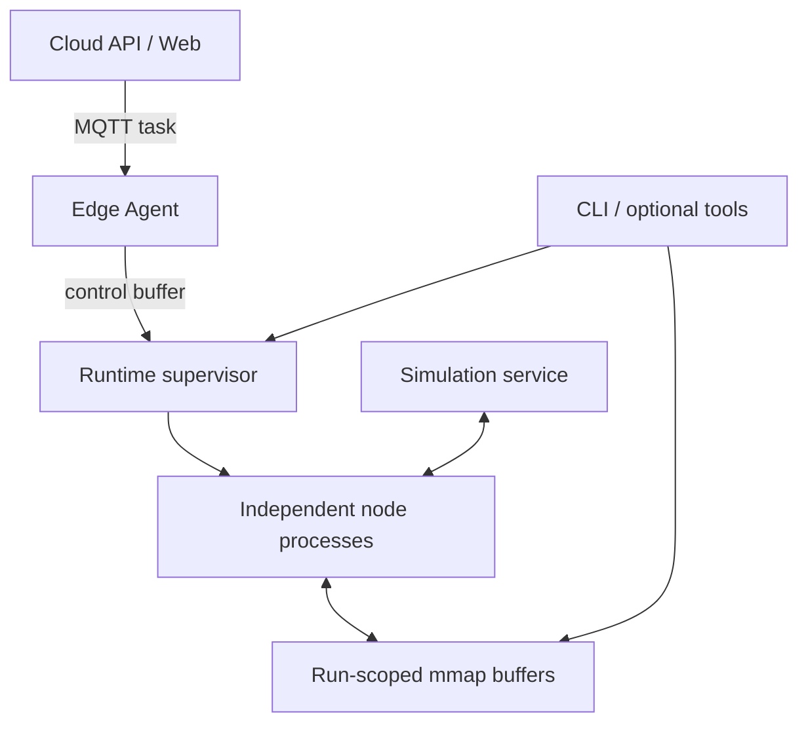

# NodeFlow

[](https://www.python.org/)
[](LICENSE)

NodeFlow 是一个面向农业机器人的配置驱动节点编排系统。运行图由 YAML 描述；每个节点运行在独立进程中；节点之间通过本机 mmap 共享缓冲区交换“最新值”。仓库同时包含农田仿真、边侧任务代理、局域网农场管理服务以及一组诊断和编辑工具。

当前主线首先服务于单机边缘运行和受监督的实机/仿真验证。它不是进程内热插拔框架，也不把云端、编辑器或 AI 工具作为机器人运行的硬依赖。

## 系统边界

| 子系统 | 位置 | 当前职责与边界 |
|---|---|---|
| Edge Runtime | `edge/runtime/` | 解析图、校验拓扑、分层启动独立节点、监控退出、按策略重启和记录死亡现场；核心主路径 |
| Node SDK / IPC | `edge/sdk/` | 参数、输入输出端口、健康心跳、输入断流看门狗、结构化日志和 mmap latest-value IPC |
| Node Hub | `edge/nodes/` | 规划、定位、控制、传感、机具、I/O 与可观测节点；当前有 27 个 manifest |
| Simulation | `simulation/` | 平面农田/车辆/传感器仿真服务，通过 ZMQ 与桥接节点交互；观察节点提供二维与三维显示 |
| Edge Agent | `edge/agent/` | 接收 MQTT 任务、准备资产、控制 Runtime 数据流并回报状态 |
| Cloud | `cloud/server/`, `cloud/web/` | 局域网地块、机器、作业和任务管理；不是边缘闭环的必需组件 |
| Tools | `tools/` | CLI 是主要运维入口；Web Editor、GUI、MCP 和 Monitor 属于可选工具 |



详细边界见 [系统架构](docs/ARCHITECTURE.md)。

## 关键能力

- YAML 声明节点实例、参数、边和重启策略；运行前完成 manifest、端口和拓扑校验。
- 节点按拓扑层启动，同层节点启动后并发运行；就绪条件可选健康心跳或首次输出。
- 每个节点独立进程，运行时监控进程退出并按退避策略重启。
- mmap + MsgPack latest-value IPC，适合高频状态流，不承担队列、历史回放或跨机器传输。
- 每轮数据流有独立 `run_id` 和缓冲区目录；节点重启有 `incarnation` 标识。
- 节点死亡时保留退出码、stderr 尾部、最后健康快照和端口年龄等事故记录。
- CLI 可聚合运行状态、健康心跳、端口活性和最近事故。
- 仓库提供从地块规划、RTK/ENU 定位、路径跟踪到机具控制的完整农业作业图。
- 三维观察窗口共用仿真与实车遥测输入，显示车辆、机具来源、路径和覆盖，支持有限内存回放。

## 环境与安装

- Python 3.12+
- Linux 或 macOS；实机 I/O 节点还需要目标硬件和系统权限
- Node.js/npm 仅用于 Web 前端
- MQTT broker 仅用于云边任务链路

```bash
git clone https://github.com/liwuzhan/nodeflow.git
cd nodeflow

python3.12 -m venv .venv
source .venv/bin/activate
python -m pip install --upgrade pip
python -m pip install -e .
```

节点可以声明额外依赖。规划闭环仿真至少还需要：

```bash
python -m pip install -r edge/nodes/planning/global_coverage/requirements.txt
python -m pip install -r edge/nodes/observability/trajectory_viz/requirements.txt
```

其他节点按其目录中的 `requirements.txt` 安装；串口、PWM 和 Web 节点不应为纯仿真环境无差别安装。

开发和测试环境还需要：

```bash
python -m pip install -r requirements.txt
python -m pip install -r cloud/server/requirements.txt
```

安装后提供两个入口：

- `nodeflow`：直接启动 `edge.runtime.main`。
- `nodeflow-cli`：节点、缓冲区、健康、日志、Runtime 和任务管理命令。

不安装包时，可分别使用 `python3 -m edge.runtime.main` 和 `python3 -m tools.cli.core.cli`。

## 快速开始：规划闭环仿真

在两个终端中从仓库根目录运行：

```bash
# 终端 1：启动仿真服务
python3 simulation/server.py
```

```bash
# 终端 2：以前台模式运行完整规划闭环
nodeflow configs/graphs/planning_simulation.yaml
```

浏览器打开 `http://localhost:8080/3d` 查看三维农场、真值与定位估计叠加及回放；原二维轨迹和曲线位于 `http://localhost:8080/`。窗口只读，暂停回放不会停止车辆。三维模型不改变原平面运动和覆盖计算，实车覆盖按已有定位及机具控制状态估算。启动与显示边界见 [轻量三维农场观察](docs/LIGHTWEIGHT_3D_SIMULATION.md)。

前台模式会立即启动数据流，按 `Ctrl+C` 可优雅停止。也可以使用守护模式，把框架生命周期和数据流生命周期分开：

```bash
nodeflow-cli runtime start configs/graphs/planning_simulation.yaml --background
nodeflow-cli runtime start-dataflow
nodeflow-cli status
nodeflow-cli runtime stop-dataflow
nodeflow-cli runtime stop
```

常用诊断命令：

```bash
nodeflow-cli node list
nodeflow-cli status
nodeflow-cli health status sim_output
nodeflow-cli health flow --config configs/graphs/planning_simulation.yaml
nodeflow-cli buffer read sim_output.rtk_fix
nodeflow-cli logs -f
```

运行时状态默认位于 `/tmp/nodeflow`。数据缓冲区按轮次放在 `/tmp/nodeflow/runs/<run_id>/buffers`，控制面缓冲区和日志使用固定位置。可通过 `NODEFLOW_RUNTIME_ROOT` 改写根目录；持久死亡记录的位置见 [运行时、SDK 与可靠性](docs/RUNTIME_SDK_AND_RELIABILITY.md)。

## 预置运行图

版本化预配置位于 `configs/graphs/`；`examples/` 保留便于教学和编辑器使用的副本。

| 配置 | 用途 |
|---|---|
| `planning_simulation.yaml` | 仿真地块、全覆盖规划、跟踪控制、机具状态和二维/三维观察 |
| `sim_arc_tracker.yaml` | 仿真中的弧线/Bezier 跟踪控制 |
| `planning_with_real_rtk.yaml` | 使用真实 RTK 输入的规划闭环 |
| `tillage_operation.yaml` | 旋耕作业完整节点图 |
| `trajectory_playback.yaml` | 记录轨迹回放与控制 |
| `manual_trajectory_recording.yaml` | 人工遥控并记录 RTK 轨迹 |
| `web_pwm_teleop.yaml` | Web 遥控到 PWM 输出 |
| `tillage_task.yaml` | 任务定义，不是 Runtime 图 |

实机运行前必须检查设备路径、PWM 安全位、坐标参考、速度/转角限制和急停链路。示例配置不是通用的安全标定值。

## 仓库结构

```text
NodeFlow/
├── edge/
│   ├── runtime/          # 图加载、编排、监督和事故记录
│   ├── sdk/              # NodeFlowSDK、端口、SharedBuffer、日志与健康
│   ├── nodes/            # 节点库；每个可注册节点包含 node.yaml
│   └── agent/            # MQTT 边侧任务代理
├── contracts/            # 云边共享任务契约
├── configs/graphs/       # 版本化运行图与任务预设
├── simulation/           # 独立农田仿真服务
├── cloud/
│   ├── server/           # FastAPI、SQLAlchemy、MQTT、SSE
│   ├── web/              # 农场管理 Vue 前端
│   └── monitor/          # 辅助只读监工界面
├── tools/
│   ├── cli/              # 主要运维 CLI
│   ├── editor/web-editor/# 可视化图编辑器
│   ├── gui/              # Tk Runtime 控制面板
│   └── mcp/              # 实验性 AI/MCP 调试服务
├── tests/                # unit / integration / smoke / legacy
├── examples/             # 示例配置副本
└── docs/                 # 当前说明、专题设计与历史审查材料
```

旧路径 `runtime/`、`sdk/`、`node-hub/`、`simulator/` 已分别迁移到 `edge/runtime/`、`edge/sdk/`、`edge/nodes/`、`simulation/`。迁移依据见 [DISPOSITION.md](DISPOSITION.md)。

## 文档导航

- [系统架构](docs/ARCHITECTURE.md)：模块边界、数据面/控制面和成熟度。
- [运行时、SDK 与可靠性](docs/RUNTIME_SDK_AND_RELIABILITY.md)：图生命周期、manifest、节点开发、IPC、重启与死亡记录。
- [节点与预置图目录](docs/NODES_AND_GRAPHS.md)：27 个节点的职责和 8 个预置配置。
- [云边任务系统](docs/CLOUD_EDGE_TASKS.md)：Cloud API、MQTT、Edge Agent、任务状态和部署边界。
- [仿真、CLI 与开发工具](docs/SIMULATION_AND_TOOLS.md)：仿真协议、诊断工具、编辑器、GUI 和 MCP。
- [仿真闭环与纯 RTK 复现实验](docs/SIMULATION_RTK_EXPERIMENTS.md)：可重复直线实验、实态机具反馈和累计覆盖评价。
- [轻量三维农场显示](docs/LIGHTWEIGHT_3D_SIMULATION.md)：已接入的实时三维窗口、仿真/实车来源、失联冻结与内存回放。
- [UM982 双天线与低速纠偏](docs/UM982_HEADING_AND_TRACKING.md)：主从定向约定、输入链路修复、YAML选择跟踪方法与仿真对照。
- [连续旋耕规划器](docs/CONTINUOUS_TILLAGE_PLANNERS.md)：大半径隔行回转、NEPath 螺旋候选和整田闭环对照。
- [主体大回转与沿边补作业](docs/HYBRID_BOUNDARY_COVERAGE.md)：按剩余面积选取补边段，抬机具转场与实际覆盖验证。
- [测试说明](tests/README.md)：权威测试入口、pytest 收集范围和 CI 范围。
- [文档索引](docs/README.md)：当前文档、专题文档和历史材料的区分。

## 质量检查

仓库的权威测试入口是：

```bash
./tools/run_tests.sh collect    # 只检查测试收集
./tools/run_tests.sh quick      # unit + cloud/server/tests；与当前 CI 一致
./tools/run_tests.sh full       # pytest.ini 收集范围内的完整测试
./tools/run_tests.sh preflight  # 运行环境预检
```

CI 在 Ubuntu 和 macOS、Python 3.12 上执行测试收集与 `quick`。仿真专用测试、MCP、前端和部分硬件节点不在默认 pytest/CI 范围内，需要按子系统单独验证。

## 成熟度与安全说明

- Edge Runtime、SDK、主节点库和仿真是当前主要开发与验证路径，适合受监督的联调和田间测试。
- 云端与 Edge Agent 已形成代码级闭环，但需要 MQTT、网络、资产下载和目标机 Runtime 的整链路部署验证后，才能用于无人值守作业。
- Web Editor、GUI、Monitor 和 MCP 是辅助工具；其可用性不应成为边缘控制闭环的前置条件。
- Cloud 默认关闭认证并允许宽松 CORS，定位为受控局域网开发部署，不能原样暴露到公网。
- NodeFlow 提供进程监督、诊断事实和故障恢复基础设施，但不替代硬件急停、独立安全控制器、危险分析或功能安全认证。

## 许可证

本项目采用 [GPLv3](LICENSE) 许可证。
