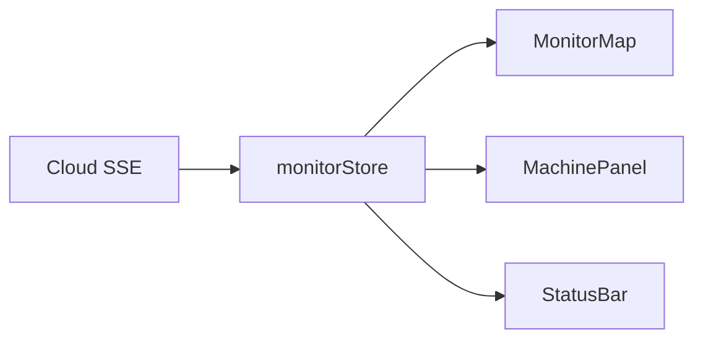

# NodeFlow Monitor

`cloud/monitor/` 是保留的只读监工前端，用全屏地图显示车辆、地块、作业进度和 SSE 连接状态。

它与 `cloud/web/` 的职责不同：

- Monitor：只读现场观察；
- Cloud Web：地块、机器、作业和任务管理，是当前主要前端。

## 开发运行

当前 Vite 代理把 `/api` 转发到 `localhost:8000`，因此从仓库根目录用相同端口启动 Cloud：

```bash
python3 -m uvicorn cloud.server.app:app --host 127.0.0.1 --port 8000
```

然后：

```bash
cd cloud/monitor
npm install
npm run dev
```

开发服务器使用 3000 端口。构建：

```bash
npm run build
```

## 数据流



Monitor 是辅助界面，当前没有替代 `cloud/web/`，也不在仓库默认 CI 的前端构建范围内。启用前应复核 Cloud API/SSE 字段、代理端口和认证策略。
