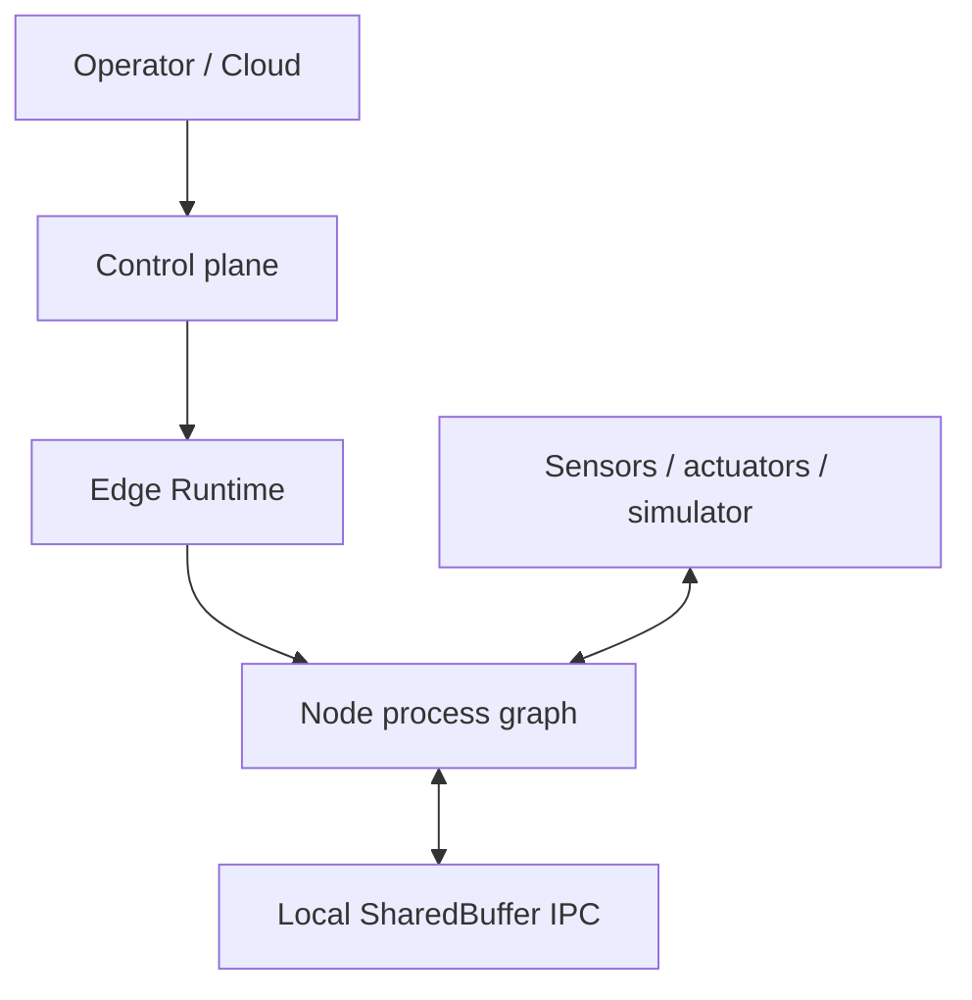
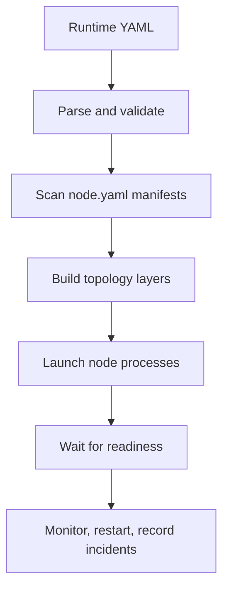
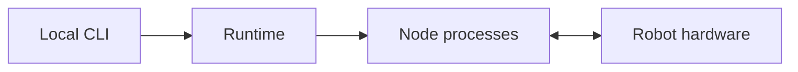

# NodeFlow 系统架构

本文描述当前仓库的实现边界。NodeFlow 的核心不是在单个进程内替换组件，而是管理一组独立节点进程，并让故障可以被隔离、观察、记录和恢复。

## 1. 总体分层

| 层 | 实现 | 主要职责 |
|---|---|---|
| 业务管理 | `cloud/server`, `cloud/web` | 地块、机器、作业、任务和资产管理 |
| 云边协议 | `contracts`, MQTT, HTTP | 任务版本、状态转换、下发、确认、状态与心跳 |
| 边侧接入 | `edge/agent` | 接收任务、校验和准备资产、控制本地数据流 |
| 进程编排 | `edge/runtime` | 配置验证、拓扑排序、启动、就绪、监督、重启和事故记录 |
| 节点运行 | `edge/sdk`, `edge/nodes` | 节点参数、端口、数据处理、健康和日志 |
| 外部环境 | `simulation` 或真实硬件 | 车辆动力学、传感器、执行器和地块环境 |
| 运维工具 | `tools/cli` 等 | 状态、日志、缓冲区、健康、任务和图编辑 |

## 2. 数据面与控制面

### 数据面

节点端口使用本机文件映射的 SharedBuffer。输出端口是单写者，输入端口可以被多个读者读取；数据使用 MsgPack 编码。语义是“读到最新快照”，而不是“消费每一条消息”。

数据面适合：

- RTK、位姿、目标点、速度命令、机具状态等持续更新的状态流；
- 下游只关心当前值、允许覆盖中间样本的控制链路；
- 单机进程间低开销通信。

数据面不提供：

- 消息队列、背压、逐条确认、历史回放和 exactly-once；
- 跨主机传输；
- 多写者冲突协调；
- 事务或分布式一致性。

### 控制面

Runtime 的 `runtime.control`、`runtime.status` 和 `control.shutdown_request` 使用固定控制缓冲区，供 CLI 和 Agent 在数据流轮次之外访问。每次启动数据流都会生成新的 `run_id`，业务数据缓冲区放入对应的 run 目录。

云边控制通过 MQTT 和 HTTP 完成，不复用节点数据面：

- MQTT：任务下发、取消、ACK、状态和机器心跳；
- HTTP：地块和路径资产下载、Cloud REST API；
- SSE：Cloud 到 Web 前端的实时更新。

## 3. 核心运行路径

1. Runtime 解析 `graph_id`、节点实例、边和重启策略。
2. Node Hub 扫描 `edge/nodes/**/node.yaml`。
3. 配置校验检查节点 ID、引用、端口存在性和图结构；端口类型不匹配以警告呈现。
4. 拓扑分析生成启动层；同层节点依次创建、整体按就绪条件等待，然后进入下一层。
5. Launcher 为节点注入参数、输入/输出 buffer 名、run 身份、incarnation 和日志目录。
6. NodeMonitor 观察子进程退出，记录事故，并在重试预算内退避重启。
7. 停止时 Runtime 优先执行数据流级清理，再结束框架；紧急清理会终止剩余子进程组。

## 4. 进程与故障模型

- 每个节点是独立 OS 进程。节点内部可以自行使用线程，但 Runtime 的隔离和恢复单位是进程。
- 节点异常退出不会直接破坏其他节点的地址空间；Runtime 是监督者。
- Runtime 只重启失败节点，不做进程内代码热替换，也不恢复节点私有内存状态。
- SharedBuffer 保存最近快照，使读者在短暂重连后可以重新读取当前状态；这不等价于业务状态回滚。
- 输入端口能在 buffer 暂时缺失、文件世代变化或序列异常后重开并重同步。
- 对声明为持续流的输入，可在 manifest 中启用 `input_watchdog`；超时默认使节点明确退出，交给 Runtime 记录和重启。
- 事故记录是诊断证据，不是自动根因证明。死亡时看到的上游端口年龄属于框架旁证，节点最后健康快照才更接近其生前视角。

可靠性细节见 [运行时、SDK 与可靠性](RUNTIME_SDK_AND_RELIABILITY.md)。

## 5. 配置与事实源

| 内容 | 事实源 |
|---|---|
| 节点接口、参数、入口和就绪条件 | 对应节点目录中的 `node.yaml` |
| 可复用运行图 | `configs/graphs/*.yaml` |
| 教学/编辑器示例 | `examples/*.yaml` |
| 云边任务状态与版本 | `contracts/task.py` |
| Runtime CLI 行为 | `tools/cli/core/cli.py` 及其 `--help` |
| Python 安装入口 | `setup.py` |
| 默认 pytest 范围 | `pytest.ini` |
| CI 快速测试范围 | `.github/workflows/test.yml`, `tools/run_tests.sh` |

`configs/graphs/` 与 `examples/` 当前存在同名副本。新增生产预设应先维护 `configs/graphs/`，并在确有教学或编辑器需要时同步副本。

## 6. 部署拓扑

最小边缘部署只需要 Runtime、SDK、所需节点和硬件依赖：

完整局域网部署在此基础上增加 Cloud、MQTT broker 和 Edge Agent：

仿真部署用 `simulation/server.py` 替换真实传感器/执行器，通过 `sim_output` 与 `sim_input` 桥接到节点图。

## 7. 成熟度边界

| 范围 | 当前定位 |
|---|---|
| Runtime / SDK / 主节点库 | 主线；用于仿真、开发和受监督的边缘验证 |
| Simulation | 主线开发辅助；用于规划和控制闭环回归 |
| Cloud / Edge Agent | 已实现的局域网编排子系统；无人值守前需整链路部署和故障演练 |
| CLI | 主要运维接口 |
| Web Editor / GUI | 可选的人机界面，不是运行必要条件 |
| MCP | 实验性 AI 调试入口，启用前应单独复核依赖和路径 |
| Cloud Monitor | 保留的只读监工前端，尚未替代主 `cloud/web` |
| 历史文档和旧测试 | 决策参考，不代表当前接口保证 |

## 8. 明确不在核心范围内

- 单进程模块热插拔、代码补丁回滚或 CORDIS 式时空可逆执行；
- Kubernetes、分布式调度或跨机器共享内存；
- 高频样本的持久事件存储与完整回放；
- 自动安全认证、硬件急停替代或无监督实机运行保证；
- Cloud 默认配置下的公网多租户和强身份认证。

这些能力若未来需要，应作为独立子系统引入，而不是继续扩大 Runtime 的单机进程监督职责。
