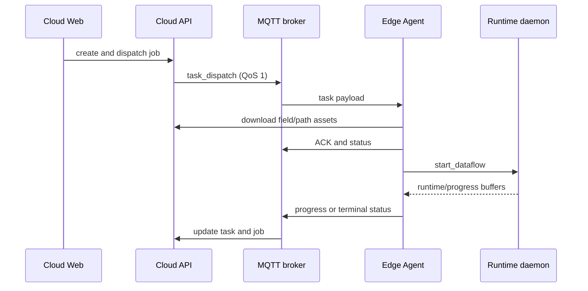

# 云边任务系统

Cloud 与 Edge Agent 提供“农场作业建模 → 机器分配 → 任务下发 → 本地数据流执行 → 状态回传”的局域网链路。它建立在 Edge Runtime 之上，但不是本地节点闭环的必需组件。

## 1. 组件

| 组件 | 位置 | 职责 |
|---|---|---|
| FastAPI 服务 | `cloud/server/` | 地块、机器、作业、任务、文件、坐标系和事件 API |
| Cloud Web | `cloud/web/` | 农场地图、机器、作业创建/详情与设置界面 |
| MQTT broker | 外部服务 | 任务/取消下发、ACK、状态和机器心跳 |
| Edge Agent | `edge/agent/` | 订阅目标机器主题、校验任务、下载资产、控制 Runtime |
| Runtime Daemon | `edge/runtime/` | 接收控制 buffer 命令，启动/停止本地数据流 |
| 共享契约 | `contracts/task.py` | 协议版本、规划模式、回退策略和任务状态转换 |



## 2. Cloud 数据与 API

SQLAlchemy 模型包括：

- `CoordinateFrame`
- `Parcel` 与 `ParcelSplit`
- `Machine`
- `Job` 与 `JobStep`
- `EdgeTask`
- `PathArtifact`

业务 API 统一挂在 `/api/v1`：

| 路径族 | 主要行为 |
|---|---|
| `/parcels` | 地块 CRUD、分割预览、GeoJSON |
| `/machines` | 机器 CRUD、确认 |
| `/jobs` | 作业创建/查询、下发、取消、任务列表 |
| `/tasks/{id}` | 任务详情与重试 |
| `/settings/coordinate-frame` | 坐标参考读写 |
| `/download` | 分割地块 GeoJSON 与 MsgPack 路径资产 |
| `/events/status` | SSE 状态事件 |
| `/health` | 服务、MQTT 和 SSE 健康摘要 |

Web Editor API 由同一 FastAPI 应用挂在 `/editor`，不属于 `/api/v1` 农场业务 API。

## 3. 任务契约

当前协议版本为 `1.0`。任务包含目标机器、preset、节点参数、地块/路径引用、坐标系、规划模式和校验和。

规划模式：

| 模式 | 行为 |
|---|---|
| `edge` | Edge 根据地块在本地规划 |
| `cloud` | 必须使用 Cloud 下发的版本化路径资产 |
| `cloud_preferred` | 优先 Cloud 路径；按回退策略决定失败时是否本地重规划 |

回退策略当前为 `deny` 或 `allow_edge_replan`。

任务状态集合：

```text
queued → pending → downloading → ready → running
                                  ↘ completed
                                  ↘ failed
                                  ↘ cancel_requested → cancelled
running ↔ communication_lost
```

`completed`、`failed` 和 `cancelled` 是终态。实际允许转换以 `contracts/task.py` 的 `can_transition_task_state()` 为准。

## 4. Edge Agent 行为

Agent 默认使用机器 ID 构造主题：

```text
nodeflow/<machine_id>/task/dispatch
nodeflow/<machine_id>/task/cancel
nodeflow/<machine_id>/task/ack
nodeflow/<machine_id>/status
nodeflow/<machine_id>/heartbeat
```

收到任务后：

1. 校验目标 `machine_id` 和协议版本；
2. 对 QoS 1 重复投递执行幂等 ACK；机器已有活动任务时拒绝新任务；
3. 获取内嵌地块或下载 GeoJSON，校验几何和可选 checksum；
4. Cloud 规划模式下下载 MsgPack 路径，校验任务、版本、地块 checksum 和坐标系；
5. 准备本地任务资产并通过 `runtime.control` 发送 `start_dataflow`；
6. 从运行缓冲区估算进度；满足终点、停车和机具安全条件后完成并停止数据流；
7. 取消任务时发送 `stop_dataflow` 并回报 `cancelled`。

本地任务状态默认保存在 `/tmp/nodeflow/tasks.json`，任务资产默认在 `/tmp/nodeflow/task-assets`。这两者默认都不是断电持久存储。

## 5. 开发环境启动

安装服务依赖：

```bash
python -m pip install -r cloud/server/requirements.txt
```

准备 MQTT broker，例如本机 Mosquitto，然后从仓库根目录启动 API：

```bash
python3 -m uvicorn cloud.server.app:app --host 0.0.0.0 --port 8080
```

启动管理前端：

```bash
cd cloud/web
npm install
npm run dev
```

前端开发服务器默认在 5173，`/api/v1` 代理到 `localhost:8080`。

边缘机器上先启动对应 preset 的 Runtime Daemon，再启动 Agent：

```bash
nodeflow-cli runtime start configs/graphs/planning_with_real_rtk.yaml --background

export NF_MACHINE_ID=edge-01
export NF_MQTT_BROKER=localhost
export NF_MQTT_PORT=1883
export NF_HTTP_SERVER_URL=http://localhost:8080
python3 -m edge.agent.agent_main
```

Agent 主要环境变量：

| 变量 | 默认 | 用途 |
|---|---|---|
| `NF_MACHINE_ID` | 主机名 | Cloud 中必须使用同一机器 ID |
| `NF_MQTT_BROKER` | `localhost` | MQTT broker |
| `NF_MQTT_PORT` | `1883` | MQTT 端口 |
| `NF_TASK_AUTO_ACCEPT` | `true` | 接收后是否自动准备和执行 |
| `NF_HTTP_SERVER_URL` | `http://localhost:8080` | Cloud 资产下载基址 |
| `NF_TASK_DATA_DIR` | `/tmp/nodeflow/task-assets` | 下载路径资产目录 |
| `NODEFLOW_ROOT` | 仓库根目录 | Agent 解析项目资源的根目录 |

Cloud 使用 `NF_CLOUD_` 前缀的设置：

| 变量 | 默认 |
|---|---|
| `NF_CLOUD_DATABASE_URL` | SQLite `cloud/server/farm.db` |
| `NF_CLOUD_MQTT_BROKER` / `PORT` | `localhost:1883` |
| `NF_CLOUD_HTTP_SERVER_HOST` / `PORT` | `0.0.0.0:8080` |
| `NF_CLOUD_HTTP_PUBLIC_BASE_URL` | `http://localhost:8080` |
| `NF_CLOUD_AUTH_ENABLED` | `false` |

## 6. 部署与可靠性边界

当前链路已经包含 QoS 1、重复投递 ACK、dispatch 重试、机器心跳、任务状态转换、资产 checksum 和 Cloud/Edge 规划回退。但在无人值守使用前，仍应对目标部署验证：

- Runtime Daemon、Agent 与 preset/节点参数是否完全一致；
- MQTT 断线、重复投递、ACK 丢失和 Cloud 重启后的收敛；
- 大路径下载超时、磁盘不足、断电与任务恢复；
- 坐标系 revision、地块 checksum 和路径 revision 的一致性；
- 机器忙、取消竞争、任务完成判定和机具安全状态；
- SQLite、MQTT 和资产目录的备份与持久化；
- 认证、TLS、网络 ACL 和审计。

默认 `AUTH_ENABLED=false` 且 CORS 允许任意来源。因此当前配置只适合受控开发网/局域网，不能直接暴露到公网。Cloud 不应成为本地急停或执行器失能的唯一通道。

更详细的阶段性说明见 [Cloud 开发文档](../cloud/docs/DEVELOPMENT.md) 和 [Cloud 集成文档](../cloud/doc/CLOUD_INTEGRATION.md)；若其中的旧路径与本文冲突，以当前源码为准。
