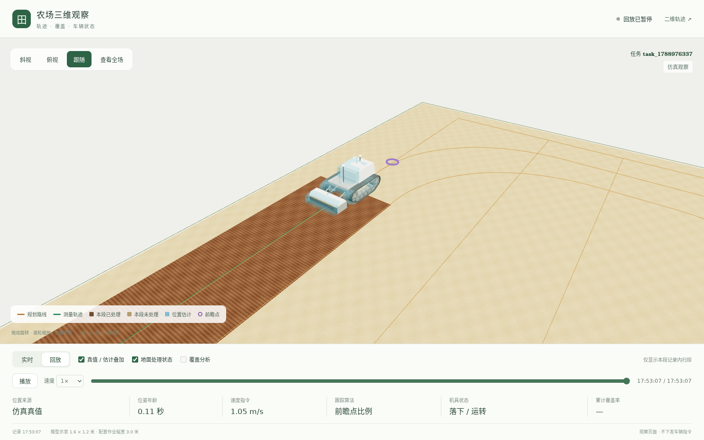
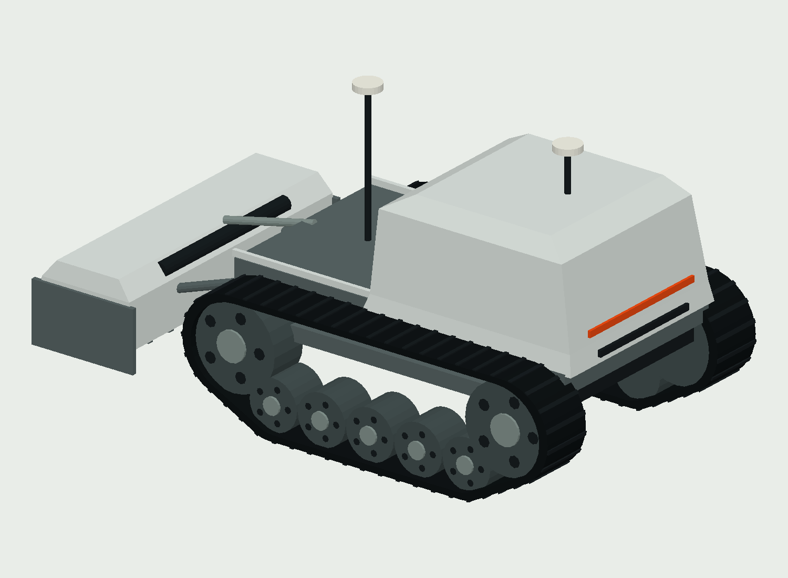

# 轻量三维农场观察窗口

三维观察窗口已接入现有 `trajectory_viz` 节点。仿真时看车辆真值与定位估计的差别，接入实车数据时看车辆位置、路径和状态；两者共用同一页面。车辆运动与覆盖仍由原来的计算链路负责，页面只读取结果。

下面是实际运行仿真任务后取得的回放画面，显示真值与定位估计叠加；不是实车记录。[全田视角与截图来源](images/monitor_3d/README.md)。



## 1. 启动与查看

安装仓库及相关节点依赖后，在仓库根目录的两个终端中分别运行：

```bash
# 终端 1：仿真服务
python3 simulation/server.py
```

```bash
# 终端 2：规划、跟踪与观察节点
python3 -m edge.runtime.main configs/graphs/planning_simulation.yaml
```

浏览器打开 `http://localhost:8080/3d`；原二维轨迹、曲线与复盘页面仍在 `http://localhost:8080/`，两页可以互相跳转。

三维页面使用随仓库提供的 Three.js r180、视角控制、模型加载器和 GLB 模型，运行时不从外部网站加载这些资源。浏览器需要支持三维图形加速。仿真图监听 `0.0.0.0:8080`，同一局域网可使用运行电脑的地址访问；实车图沿用 `127.0.0.1`，需要局域网观察时可在图中调整 `web_host`。

## 2. 当前能看什么

| 画面内容 | 当前行为 |
|---|---|
| 农田、边界与孔洞 | 在平面地面绘制任务地块，孔洞保持为空，不将其涂成可作业区域 |
| 车辆与后挂机具 | 按位置、航向显示车辆；可靠的机具真值或实际反馈驱动升降 |
| 规划路线与测量轨迹 | 对照计划与经过的路线；任务变化后清除旧路线 |
| 地面处理状态 | 未处理区域保留浅色干土，已处理区域显示深棕色细条纹；实时使用累计扫掠，回放随记录时间展开 |
| 覆盖分析 | 可单独打开重复与遗漏着色，默认关闭；孔洞不涂色，材质不改变统计面积 |
| 仿真真值与定位估计 | 实体车辆显示真值，半透明车辆显示控制链路使用的定位估计，可开关叠加 |
| 前瞻点与状态 | 显示当前前瞻点、位姿年龄、速度指令和跟踪方法；过期前瞻点隐藏 |
| 俯视、斜视、跟随 | 支持全场取景、拖动旋转、缩放和平移 |
| 内存回放 | 播放、暂停、拖动时间位置，以及 0.5、1、2、4 倍速 |

原始 RTK 的定位质量、航向有效性和数据年龄已经可以通过可选输入进入观察接口。当前三维页面尚未单独绘制原始 RTK 点、独立航向箭头或新的纠偏曲线；厘米级误差仍应结合二维图和实验曲线观察。

覆盖图直接复用原评价结果，不用模型中心划出的彩带代替机具扫掠，也不把模型外观尺寸当成作业幅宽。三维显示没有修改控制、机具时序或覆盖计算规则。

仿真覆盖使用已有真值评价。实车覆盖仍根据定位和机具控制器状态估算，页面明确标注“机具按控制状态估算”，不能当成实际农艺完成的验证。新增直接 `implement_state` 反馈用于显示帧、机具动画和本段回放地面重建，没有接管实时累计覆盖计算。

## 3. 模型与坐标

模型保留两条连续履带、前部高起电池舱、低后甲板和独立后挂机具。无驾驶室，少量折面表达塑料上盖，内部电机、齿轮和紧固件省略。两个 RTK 天线是外观部件，实际主从身份与安装偏移仍由设备配置决定。

显示比例按底盘长 1.6 米、宽 1.2 米，长度不含后挂机具。电池高度、轮径、悬挂和配色是示意值。图中车辆的 `implement_width_m` 仍决定覆盖评价幅宽，不能因显示模型宽 1.2 米而自动改写；页面同时显示模型尺寸与已收到的配置幅宽。

模型、生成脚本与命名约定见 [模型资产说明](../simulation/assets/tracked_tiller/README.md)。可用正式模型替换 GLB，保留车体与机具分组以继续显示升降。



所有位置使用任务的同一个局部坐标：东、北、上，在显示中映射为 `(东, 上, -北)`。`sim_output.state_info` 已将仿真世界位置转换到任务坐标，浏览器不再次平移；`world_position` 只保留为原世界位置记录，不作为本页面的车辆位置。

当前是平面运动的三维显示。已有高度、俯仰和侧倾字段可以显示，没有对应输入时使用平地姿态，不添加随机颠簸。视觉插值只连接已收到的状态，断流后冻结，不预测车辆继续行驶。

## 4. 仿真与实车共用的数据边界

| 输入或来源 | 显示含义 |
|---|---|
| `state_info` | 可选的仿真真值。连接后主车辆始终等待或使用真值，不用估计位姿悄悄补成真值 |
| `pose_enu` | 定位链路给出的位姿；仿真中作为对照，未接真值的实车中作为主车辆位置 |
| `raw_rtk` | 可选原始 RTK 包，保存定位质量、航向有效性、来源和年龄等诊断信息 |
| `implement_state` | 可选的实际机具反馈，包含悬挂高度、动力输出开关与转速 |
| `tillage_status` | 机具控制器的逻辑状态；明确标为控制器估计，不当作实际升降反馈 |
| `next_point`、`velocity_cmd` | 前瞻目标与速度指令；指令值不等于实测速度 |

机具显示依次选取仿真真值、实际 `implement_state`、控制器逻辑状态。只有前两者的新鲜数据驱动实际升降动画；逻辑状态或反馈缺失时，页面说明未接实测，机具淡化显示。控制器的 `ready_source: feedback` 只表示就绪条件经过反馈检查，它输出的逻辑高度仍然不是实测高度。

位姿必须同时具备有限的位置与航向；缺航向、无效标记和非有限数值不会被补成默认朝向。节点保留最后有效位姿，年龄取本机单调时钟与最后有效收包时间之差。源时间戳另外保留，不用来假设各设备时钟已同步。

默认超过 1 秒未更新即标为数据过期，车辆停留在最后位置。观察循环或网络停止更新时，接口和页面也会继续增长年龄或显示连接中断，不让静止的旧画面继续显示为在线。这个阈值只影响观察状态，不改变车辆的控制超时配置。

实车接入方式已经具备，但本轮没有实车验证。实际监控看到的是定位估计和已有反馈，不是仿真真值。

## 5. 刷新与回放

| 参数 | 默认值 | 作用 |
|---|---|---|
| `frame_interval_s` | `0.1` 秒 | 姿态、机具和状态小包，约每秒 10 次；无新数据也发送年龄心跳 |
| `scene_interval_s` | `1.0` 秒 | 田界、路径、轨迹和累计覆盖等大场景数据 |
| `stale_after_s` | `1.0` 秒 | 本地数据过期判定 |
| `update_interval` | `5.0` 秒 | 仅控制日志打印频率 |
| `replay_sample_interval` | `0.2` 秒 | 有新主位姿时记录回放帧，不把失联心跳录成新轨迹 |
| `max_replay_samples` | `3000` | 内存中的回放容量，默认约 10 分钟连续数据 |

浏览器独立轮询小包与场景，不按绘图帧数重新计算覆盖。回放帧同时保存真值、估计和当时的状态，与原二维评价样本分别保存。

横向误差按规划折线的全部线段建立空间索引，求每个轨迹点到完整折线的最近距离。这样减少大田长路径的搜索开销，不抽稀路径点，也不改变误差定义。

回放进入时，按已保存的位姿与机具状态重建本段记录中的扫掠，再随时间展开或收回。抬起、停转、反馈过期或记录断档时不连接扫掠；田界外和孔洞内不涂成已处理。几何复用原机具扫掠算法，画面中的细条纹只表达土面差异，不模拟沟槽或土壤变形。

回放显示的仅是当前保留记录内的处理范围。记录开始前的作业不会被补画；整场累计覆盖率仍然隐藏，避免用最终累计面积代替历史值。拖动时间只调整已构建图形的可见范围，不重新计算整场覆盖。

回放只保存在当前节点进程的内存中。任务变化会清除旧田界孔洞、路线、状态和回放；进程退出后记录消失。断流不会自动补帧，保留记录的实际时间跨度随输入频率而变化。需要跨次运行的长期记录时，应另接文件记录工具。

## 6. 代码与只读接口

| 位置或接口 | 职责 |
|---|---|
| [monitor.py](../edge/nodes/observability/trajectory_viz/monitor.py) | 将真值、估计和机具来源转换成统一显示帧 |
| [run.py](../edge/nodes/observability/trajectory_viz/run.py) | 接收节点输入，分别按姿态与场景节拍更新，管理任务切换 |
| [web_server.py](../edge/nodes/observability/trajectory_viz/web_server.py) | 复用原观察服务，提供页面、模型与有界内存记录 |
| [static/3d](../edge/nodes/observability/trajectory_viz/static/3d/index.html) | 三维场景、视角和回放交互 |
| `GET /api/monitor/frame` | 最新统一显示帧；尚未收到时返回 `null` |
| `GET /api/monitor/scene?since=<revision>` | 地块、路径与覆盖；版本未变时返回 `unchanged` |
| `GET /api/monitor/replay` | 当前内存中的三维回放帧；加 `?ground=1` 同时返回按原帧索引排列的扫掠增量 |

这些新增接口只读取观察数据，不下发车辆命令。页面的暂停只暂停回放，不暂停真实车辆或仿真计算。

## 7. 后续范围

下一步可根据田间诊断需要补原始 RTK 点与航向箭头、关联二维曲线，以及导出可重新加载的记录。坡地动力学、土壤颗粒、天气、作物生长、复杂碰撞和逐节履带运动不属于当前观察窗口。

## 8. 本轮验证范围

第一版监控适配、数据过期、只读接口、任务切换、覆盖、图配置与跟踪相关的 146 项测试通过。浏览器检查了本地模型加载、三种视角、回放、断联、旧任务数据迟到及窄屏布局。

完整 10 节点仿真图在 20×30 米田块运行 60 秒，生成 767 个路径点，取得真值、定位估计、机具状态和 178 帧回放。大田试运行暴露的误差计算瓶颈已单独修复，并用实际 30,318 点路径与 3,000 点轨迹做性能检查。这些结果验证了显示链路，不代表实车验证或目标硬件上持续 10 Hz 的性能验收。

地面材质与回放地面更新后，针对性复跑的 70 项检查通过，覆盖机具停转/抬升、反馈过期、断档、来源切换、田界孔洞及接口兼容。浏览器使用仿真记录验证了地面随时间展开、后退恢复、显示开关和本地纹理加载。
