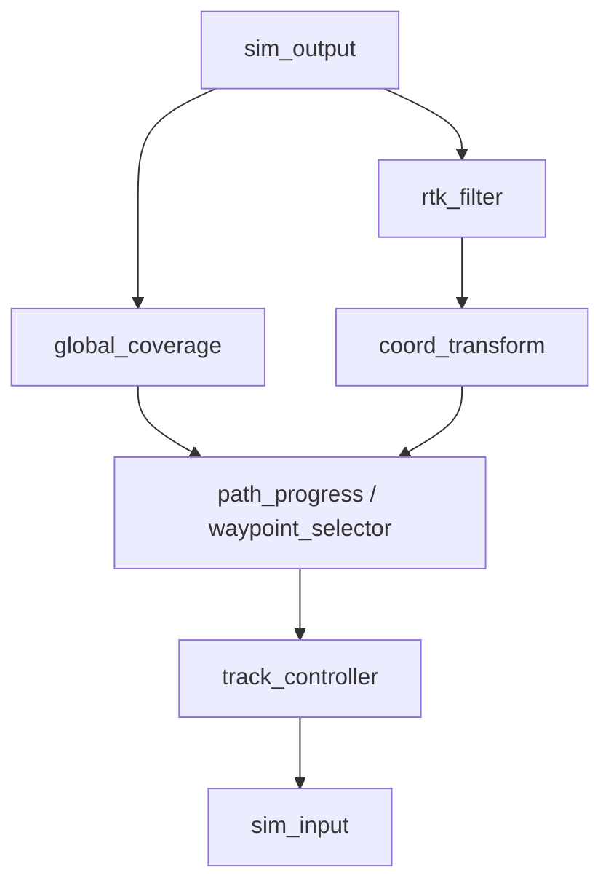

# 节点与预置图目录

当前 Node Hub 位于 `edge/nodes/`。Runtime 以递归扫描到的 `node.yaml` 注册节点；目录存在但没有 manifest 的代码不属于可直接在图中引用的节点包。

本次复核共发现 27 个 manifest。

## 1. 控制与机具

| Package | 节点 | 职责 |
|---|---|---|
| `control/arc_tracker` | `arc_tracker` | Bezier 路径与 Pure Pursuit 弧线跟踪 |
| `control/track_controller` | `track_controller` | 履带底盘轨迹跟踪，支持原地转向和多种减速/超时约束 |
| `implement/tillage_controller` | `tillage_controller` | PTO 离合器与三点悬挂状态机，输出旋耕作业状态 |

## 2. 传感、定位与 I/O

| Package | 节点 | 职责 |
|---|---|---|
| `sensing/rtk_driver` | `rtk_driver` | 串口或网络 NMEA 输入，输出高精度 RTK 数据 |
| `sensing/rtk_filter` | `rtk_filter` | 经纬度与航向的平滑/融合 |
| `sensing/sim_output` | `sim_output` | 从仿真服务读取传感器、车辆状态和地块环境 |
| `localization/coord_transform` | `coord_transform` | WGS84 到本地 ENU 坐标转换 |
| `io/sim_input` | `sim_input` | 把速度或电机控制命令发送到仿真服务 |
| `io/pwm_driver` | `pwm_driver` | Orange Pi 5 Ultra 双通道 PWM 电机输出 |

`edge/nodes/sensing/network_input/` 当前没有 `node.yaml`，因此不在 27 个可注册节点之内。

## 3. 规划

| Package | 节点 | 职责 |
|---|---|---|
| `planning/global_coverage` | `global_coverage` | 平行扫描、轮廓螺旋、隔行大回转及沿边补作业组合规划 |
| `planning/parcel_planner` | `parcel_planner` | 读取地块配置，完成 GPS/ENU 地块规划 |
| `planning/path_progress` | `path_progress` | 将实时位姿投影到 `operation_plan`，输出段、里程和误差 |
| `planning/trajectory_loader` | `trajectory_loader` | 加载已记录或云端生成的轨迹/operation plan |
| `planning/waypoint_selector` | `waypoint_selector` | 基于视野、路径进度和转弯预判选择前瞻目标 |

## 4. 可观测、操作与兼容节点

`observability/` 包含当前诊断/人机交互节点，也保留了一些早期控制或输入实现。选择节点时应以预置图和 manifest 为准，而不要仅凭目录名判断是否属于主控制链。

| Package | 节点 | 职责 |
|---|---|---|
| `observability/logger` | `logger` | 记录和回放任意端口数据流 |
| `observability/position_recorder` | `position_recorder` | 手动或自动记录设备位置 |
| `observability/trajectory_viz` | `trajectory_viz` | 实时轨迹 Web 可视化 |
| `observability/farm_coverage_viz` | `farm_coverage_viz` | 从 RTK/作业数据生成覆盖区域可视化 |
| `observability/web_teleop` | `web_teleop` | 提供 HTTP 遥控界面并输出控制命令 |
| `observability/idle_detector` | `idle_detector` | 检测 RTK 在时间窗口内几乎不移动并发出停机事件 |
| `observability/shutdown_manager` | `shutdown_manager` | 把静止事件转发到 Runtime 关闭控制面 |
| `observability/schema_demo_node` | `schema_demo_node` | 演示 Pydantic 输出 schema 校验 |
| `observability/rmc_parser` | `rmc_parser` | 把原始 NMEA RMC 文本解析为 GPS 数据 |
| `observability/rtk` | `rtk` | 早期/模拟 RTK 输入实现 |
| `observability/controller` | `controller` | 早期车辆控制策略实现 |
| `observability/velocity_controller` | `velocity_controller` | Pure Pursuit 速度控制实现 |
| `observability/pwm_controller` | `pwm_controller` | 把控制命令转换为 PWM 信号 |

## 5. 预置运行图

`configs/graphs/` 是版本化预设位置；`examples/` 当前保留同名副本。节点数和边数取自当前 YAML。

| 文件 | 类型 | 规模 | 主数据流 |
|---|---|---:|---|
| `planning_simulation.yaml` | Runtime 图 | 10 节点 / 31 边 | 仿真传感 → 覆盖规划 → ENU/前瞻点 → 履带控制 → 仿真执行，并输出机具/轨迹状态 |
| `planning_with_real_rtk.yaml` | Runtime 图 | 11 节点 / 27 边 | 真实 RTK → 地块规划/定位 → 路径跟踪和旋耕控制 |
| `tillage_operation.yaml` | Runtime 图 | 11 节点 / 28 边 | 面向旋耕作业的完整规划、底盘和机具链 |
| `sim_arc_tracker.yaml` | Runtime 图 | 7 节点 / 9 边 | 仿真传感 → 弧线路径跟踪 → 仿真执行 |
| `trajectory_playback.yaml` | Runtime 图 | 7 节点 / 8 边 | 已录轨迹 → 前瞻点/控制 → PWM 输出 |
| `manual_trajectory_recording.yaml` | Runtime 图 | 4 节点 / 2 边 | RTK 与 Web 遥控并行，记录人工行驶轨迹 |
| `web_pwm_teleop.yaml` | Runtime 图 | 2 节点 / 1 边 | Web 遥控 → PWM 硬件输出 |
| `tillage_task.yaml` | Task YAML | 非图 | 本地任务样例，引用一个 preset 并覆盖节点参数 |

### 规划仿真主链



该图还把 operation plan、位置和控制状态送到 `tillage_controller` 与 `trajectory_viz`。精确端口连接应直接查看 [planning_simulation.yaml](../configs/graphs/planning_simulation.yaml)。

## 6. 节点包约定

典型节点包：

```text
edge/nodes/<category>/<package>/
├── node.yaml          # 必需：接口、参数、入口、就绪和可选看门狗
├── run.py             # 常见 Python 入口
├── requirements.txt   # 可选：节点特有依赖
├── schemas.py         # 可选：Pydantic 数据模型
├── README.md          # 可选：算法、硬件和运行说明
└── test/              # 可选：节点专用测试
```

新增节点时至少应验证：

1. `node.yaml` 的 package 路径、入口和实际文件一致；
2. 输入/输出端口名与 `run.py` 中的 SDK 调用一致；
3. 参数默认值、类型和运行图覆盖值一致；
4. 端口 payload 字段在上下游之间一致，不能只依赖宽泛的 `type` 字符串；
5. 持续输入才声明 `input_watchdog`，并明确执行器断流时的安全行为；
6. 把通用运行图加入 `configs/graphs/`，把硬件参数留给部署配置；
7. 使用 `nodeflow-cli node info <package>` 和测试验证 manifest。

更完整的 SDK 和故障语义见 [运行时、SDK 与可靠性](RUNTIME_SDK_AND_RELIABILITY.md)。
