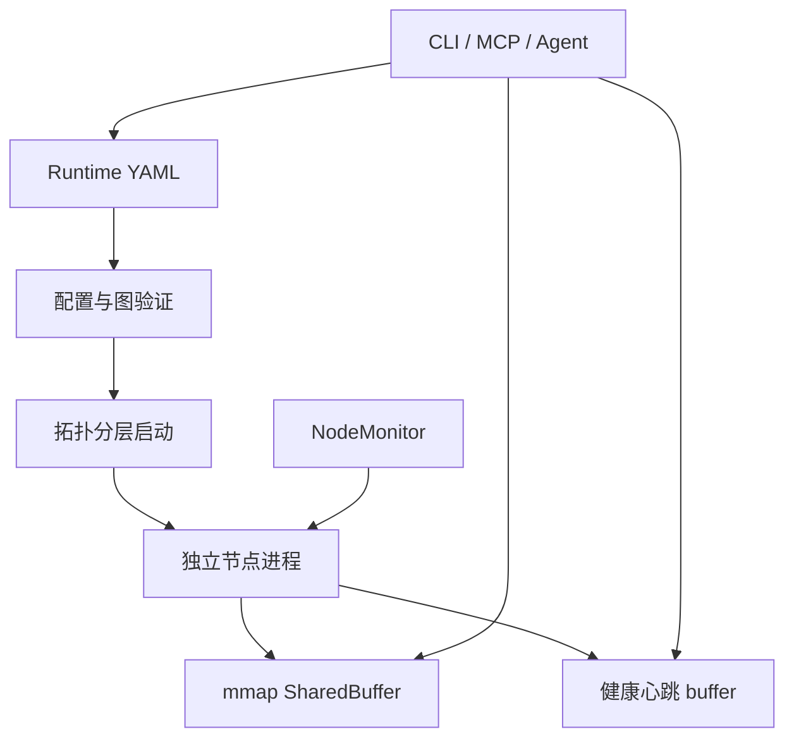
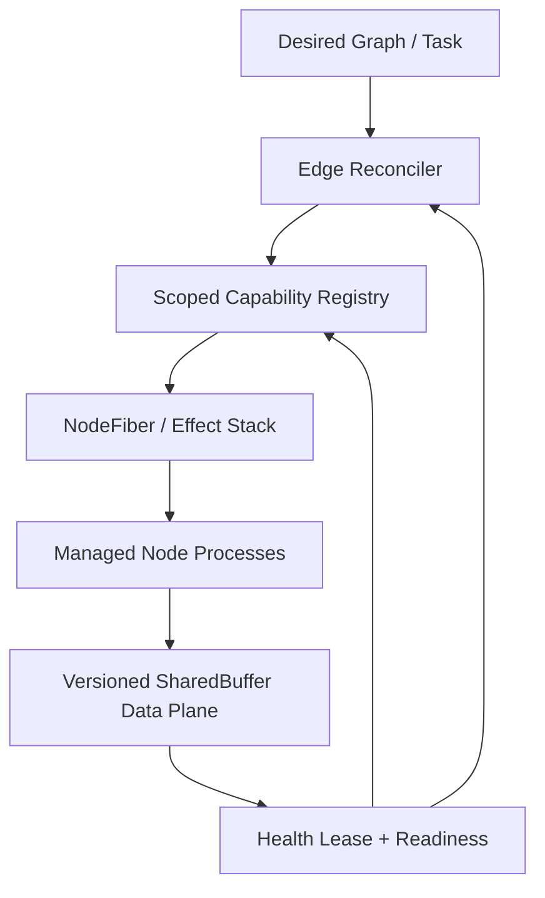

# NodeFlow 引入 Cordis 式时空可组合机制的技术调研与改造报告

> 报告日期：2026-08-28  
> NodeFlow 审计分支：`refactor/consolidate-post-ai-review`  
> NodeFlow 审计提交：`7e083215eaf6fb9683d2e64090654fdaca3f3ed5`  
> 对比基线：`origin/master`（当前审计分支领先 22 个提交、落后 0 个提交）  
> Cordis 参考：论文、官方仓库、DeepSeek Harness 官方 Cordis 文档

## 1. 执行结论

NodeFlow **值得借鉴 Cordis，但不应直接移植 Cordis，也不应改写现有数据面**。

NodeFlow 的核心优势是面向农业机器人的进程隔离、声明式数据流图、latest-value 语义和 mmap SharedBuffer。Cordis 更成熟的部分则是控制面的生命周期组合：资源如何注册、依赖如何出现或消失、失败如何回滚、配置如何收敛到期望状态，以及一组组件在何种作用域内生效。

最合适的组合是：

- 保留 NodeFlow 的节点进程、YAML 图、MsgPack 和 SharedBuffer 数据面；
- 把 Cordis 的 Fiber/effect、响应式依赖、Context scope 和 reconciler 思路引入 NodeFlow 控制面；
- 先补齐运行世代、数据时效和真实 readiness，再做动态图变更；
- 只在非执行器控制面支持热替换，物理执行链采用停机—校验—切换—恢复。

对当前农业机器人使用场景，主要收益不是“让代码更优雅”，而是四个可观测、可验收的结果：

1. 上游节点重启后，旧轨迹、旧定位和旧速度命令不会被当成本轮有效数据；
2. 节点进程仍存活但心跳或能力失效时，下游控制节点能够自动降级或暂停；
3. 启动、重启、任务切换失败时，已创建的进程、线程、buffer 和控制状态可以确定性回收；
4. 多车辆、多任务或同机多实例不再共享全局 `/tmp/nodeflow` 命名空间。

综合判断如下：

| 维度 | 结论 | 原因 |
|---|---|---|
| 可靠性 | 明显提升 | generation/TTL、能力租约、依赖失效传播和 effect 回滚直接覆盖陈旧数据、假存活、孤儿资源问题 |
| 稳态性能 | 基本中性 | 新机制放在控制面；高频端口仍走 mmap + MsgPack，不经过通用事件总线 |
| 启动与恢复性能 | 有望提升 | readiness 事件可替代按拓扑层固定等待，故障恢复只重建受影响子图 |
| 可扩展性 | 明显提升 | 能力依赖、作用域和三层身份解除“节点名=实现=运行实例”的耦合 |
| 引入风险 | 可控但不可忽视 | 响应式依赖可能抖动或形成重入环，需要状态机、迟滞、超时和不变量保护 |

**最终建议：引入“Cordis 式机制”，不引入 Cordis 运行时。**

## 2. 审计基线与验证边界

### 2.1 分支核对

本报告以远端按提交时间最新的 `origin/refactor/consolidate-post-ai-review` 为准，不再以 `master` 为准。

| 项目 | 结果 |
|---|---|
| 最新远端开发分支 | `origin/refactor/consolidate-post-ai-review` |
| 审计提交 | `7e08321`，2026-08-02 23:28:50 +08:00 |
| 与 `origin/master` 的提交差 | 领先 22，落后 0 |
| 远端默认分支 | `main` |
| `origin/main` 内容状态 | 仅初始提交，明显不是活动开发线 |
| 本地工作树 | 已切换到最新分支并跟踪同名远端分支 |

这 22 个提交包含目录重组、纯 SharedBuffer IPC、全头部一致性检查、节点健康心跳、stale 检测、启动回滚、优雅退出/preflight 测试、仿真实现控制和云端任务协调等变化。因此，旧 `master` 上关于“SharedBuffer + ZeroMQ 节点间混合 IPC”“部分启动不回滚”“没有节点心跳”的结论均已过时。

### 2.2 当前代码规模快照

- `edge/nodes/` 下有 27 个 `node.yaml` 节点包；
- `edge/runtime/`、`edge/sdk/`、`edge/agent/` 合计约 5,537 行 Python；
- 仓库中有 36 个 `test_*.py` 文件、约 231 个测试函数；
- 当前分支相对 `master` 的 diff 为 526 个文件、约 28,636 行新增和 9,549 行删除；
- 生产运行图已放到 `configs/graphs/`，典型图为 2–11 个节点。

### 2.3 验证边界

本次完成了分支、提交、目录、关键代码路径、测试清单和 CI 配置的静态审计。容器当前没有安装仓库声明的 `pytest` 与 `msgpack`，因此不能重新执行单元测试和 preflight；本报告不会把“仓库里存在测试”表述成“本次测试已通过”。性能部分给出方向性判断和必须测量的指标，不虚构吞吐或延迟数字。

## 3. 最新分支的 NodeFlow 现状

### 3.1 当前运行模型



运行时解析 YAML、扫描 `edge/nodes/`、验证节点和端口、拓扑排序，再按层启动独立进程。节点 SDK 从环境变量读取端口映射，输出端写入 SharedBuffer，输入端轮询序列号并读取最新快照。NodeMonitor 监控子进程退出并按指数退避重启；CLI 可查看 buffer 活性、节点心跳和 schema 合规性。

### 3.2 数据面：纯 SharedBuffer 已经成立

最新分支中的节点间主通道是纯 SharedBuffer：

- 每个输出端口对应一个 mmap 文件；
- payload 使用 MsgPack，并支持 NumPy ndarray 编解码；
- 单写者、多读者、latest-value 语义；
- 写端执行 `length=0 → payload → seq → length`；
- 读端前后比较完整 8 字节 header，避免只比较序列号时读到穿插写入的数据；
- `InputPort` 用 32 位模运算处理序列回绕；
- 阻塞读取以 1 ms 轮询实现。

这已经修复了旧实现中通知通道和数据通道双栈带来的复杂性。仿真节点仍通过 ZMQ 与仿真服务器通信，但那是 NodeFlow 与外部仿真器的协议，不是节点间主 IPC。

### 3.3 已经具备的可靠性基础

| 能力 | 最新分支状态 | 评价 |
|---|---|---|
| 启动失败回滚 | 同层失败先回收同层，外层异常再回收此前各层 | 已解决旧报告中的“部分启动泄漏”问题 |
| 反向关闭 | 按启动顺序逆序终止节点 | 是 effect 栈的良好起点，但只覆盖进程 |
| 进程组终止 | launcher 与紧急清理可终止进程组 | 能减少子进程残留 |
| 父进程 watchdog | 节点可检测 Runtime 父进程消失 | 对异常退出有价值 |
| 节点心跳 | `{node_id}.health` 每 2 秒默认更新 | 已有健康租约雏形 |
| stale 检测 | CLI 以 `3 × heartbeat_interval` 判定心跳过期 | 已能识别“旧 health 文件” |
| 静态输出识别 | producer 心跳新鲜时，无序列增长的 buffer 可判为 IDLE | 避免把静态配置误判为故障 |
| 自动重启 | 进程退出检测、指数退避、稳定 300 秒后清零计数 | 基础策略合理 |
| 退出验收 | preflight 检查进程、PID 文件和 5555/8080 端口释放 | 比只检查主进程退出更可靠 |
| 云端调度协调 | `DispatchReconciler` 重试 ACK 超时任务和取消请求 | 已出现 desired/observed 收敛模式，可复用于边侧 |

### 3.4 最新分支仍存在的关键缺口

#### 3.4.1 “进程活着”仍被当成 Runtime readiness

`StartupCoordinator` 每层固定等待 2 秒，层间再固定等待 1 秒；等待期间只检查进程是否退出，没有等待端口创建、心跳首报、设备初始化或业务自检。`all_alive` 变量也没有形成提前完成条件。

结果是：

- 启动时间随拓扑层数线性增加，即使所有节点已经就绪仍要等满；
- 进程没有退出并不代表 RTK 已锁定、规划器已有地图或控制器已有有效路径；
- 慢启动节点可能在下游启动时尚未创建 buffer。

#### 3.4.2 InputPort 连接失败后不会自愈

`InputPort._connect()` 最多尝试 10 次、每次间隔 0.2 秒。若两秒内 buffer 不存在，端口会永久保持 disconnected；后续 `recv_latest()` 直接返回 `None`，不会重试连接。

这与“按固定时间等待上游”的启动策略形成隐性耦合：只要设备初始化、进程调度或存储抖动超过假设，下游可能永久失联，但进程和心跳仍显示存活。

#### 3.4.3 心跳已可观测，但尚未进入自动控制闭环

NodeMonitor 当前只看 `process.poll()`。节点线程死锁、业务循环卡住、输入长期断开或 SDK 心跳停止时，CLI 可以报告 stale，但 Runtime 不会据此：

- 将节点标记为 NOT_READY；
- 暂停依赖该能力的下游节点；
- 触发重启或安全降级；
- 阻断执行器继续消费旧数据。

现有 health 是诊断工具，还不是能力租约。

#### 3.4.4 数据没有运行世代和 TTL

SharedBuffer header 仍只有 `seq + length`。心跳 payload 有时间戳，但普通端口 payload 没有统一的：

- `run_id` / `generation`；
- `producer_instance_id`；
- `produced_at` / 单调时钟时间；
- `ttl` 或 `valid_until`；
- schema/version 标识。

全量 dataflow 启动时通常会清零 buffer，但单节点自动重启会复用已有文件。消费者无法区分“本轮生产者的新输出”和“上一生产者实例留下的快照”。对于定位、轨迹和速度命令，这是安全风险，而不仅是观测问题。

#### 3.4.5 依赖语义全部压在数据边上

YAML edge 能表达 `A.output → B.input`，但不能表达：

- B 需要任意一个实现 `localization.pose` 的 provider；
- B 只有在定位质量和路径版本满足条件时才可 ACTIVE；
- 可选能力出现时增强、消失时降级；
- 上游重启时只重建相关依赖子图；
- 同一能力的 primary/backup 切换。

节点实现、节点实例、能力提供者和进程运行世代尚未分离。

#### 3.4.6 全局命名空间限制多实例

buffer 固定放在 `/tmp/nodeflow/buffers`，控制 buffer 和 PID 文件也是固定名称。若一台工控机运行两个 Runtime、两个仿真任务，或需要蓝绿切换，命名和清理操作会发生冲突。

#### 3.4.7 工程入口仍不一致

- GitHub Actions 只监听 `main` 与 `develop`，而实际最新开发在 `refactor/consolidate-post-ai-review`；
- README 上半部写“纯 SharedBuffer”，下半部仍描述“SharedBuffer + ZeroMQ、JSON、预分配 buffer”；
- `StartupCoordinator` 的注释和日志仍称 ZeroMQ；
- README 项目树仍展示旧 `runtime/`、`sdk/`、`node-hub/`、`simulator/` 路径；
- CI 使用较旧的 `actions/checkout@v3`、`setup-python@v4`、`upload-artifact@v3`。

这类不一致不会直接改变控制算法，却会让维护者和 AI 基于错误架构继续修改代码，属于现实的可靠性来源。

## 4. Cordis 架构中真正成熟的部分

Cordis 论文将目标概括为时间可组合性与空间可组合性。它解决的不是高频机器人 IPC，而是组件在运行期间的创建、依赖、卸载、隔离和重组。

### 4.1 Fiber 与 effect：生命周期可组合

Fiber 代表一个逻辑运行单元。组件注册定时器、监听器、子上下文等副作用时，同时登记 disposer；Fiber dispose 时以逆序执行清理，并要求清理幂等。

这个机制对 NodeFlow 的直接价值是：把进程、监控线程、health buffer、控制 buffer、临时文件、设备句柄和子作用域纳入同一资源账本，而不是依赖分散的 `try/finally`、`atexit` 和各模块自觉清理。

### 4.2 `inject/provide`：依赖随能力出现和消失

Cordis 不只在初始化时查找一次服务。它可以声明一个 effect 依赖哪些服务：服务满足时加载，服务消失时自动卸载，重新出现时再次加载。

这比 NodeFlow 目前“启动时连一次 InputPort”成熟。机器人中的定位、路径、云连接和机具控制都更像带租约的能力，而不是永久存在的对象。

### 4.3 Context scope：空间隔离

Cordis 使用 Context 组织服务、事件和 effect 的可见范围。子上下文继承父级能力，同时可以隔离局部配置和生命周期。

映射到 NodeFlow，可以形成：

- fleet scope：共享云连接、策略与全局观测；
- vehicle scope：车辆定位、底盘、传感器；
- task scope：当前地块、作业类型、路径版本；
- node scope：进程、端口、线程和设备资源。

### 4.4 声明式 loader 与配置协调

Cordis 以配置为期望状态，loader 负责加载、更新和卸载组件。重要的不是“能热更新”，而是每次变更都经过 diff、验证、apply、rollback，最终收敛。

NodeFlow 云端已经有 `DispatchReconciler` 的雏形，但边侧 Runtime 仍以命令式 `start_dataflow()` / `stop_dataflow()` 为主。把 reconciler 扩展到边侧，可统一处理启动、停止、重启、依赖恢复和任务切换。

### 4.5 类型化事件与运行时不变量

Cordis 区分普通广播、并行、串行、waterfall 等事件语义，并把事件绑定到 Context。NodeFlow 可借鉴这种明确语义用于低频控制事件，但不应让高频传感器数据经过通用事件总线。

同时，Cordis 的实现强调内部不变量。NodeFlow 需要为“无孤儿 effect、无越代数据、无重复 active provider、dispose 幂等”等性质建立运行时断言和测试。

### 4.6 成熟不等于 API 已稳定

Cordis 官方参考文档明确提示 API 尚不稳定。因此本报告借鉴其概念和约束，不建议把 NodeFlow 核心运行时绑定到 Cordis 包或 TypeScript 生态。

## 5. 推荐目标架构



核心边界是：

- **数据面**：继续使用 SharedBuffer，负责高频 latest-value 数据；
- **控制面**：Reconciler + Capability Registry + NodeFiber，负责期望状态、生命周期与依赖；
- **安全面**：generation/TTL/readiness/invariants，负责阻止陈旧或不满足前置条件的数据进入执行链；
- **观测面**：统一输出节点、能力、effect、重启和收敛状态。

## 6. 必要修改清单

### M0：先完成最新分支的一致性收口——必须

这不是 Cordis 机制，但必须先做，否则后续架构改造会建立在错误入口上。

1. 让 CI 覆盖实际开发分支，并确定 `main`、`master`、refactor 分支的合并和默认分支策略；
2. 修正 README、StartupCoordinator 日志和旧路径说明；
3. 在 CI 中至少执行 unit、云端服务测试和 `--collect-only`；
4. 将 preflight 作为 Linux 专用验收，并保留优雅退出残留检查；
5. 锁定 Python 依赖并生成可复现环境，避免“代码有测试但环境跑不起来”。

### M1：InputPort 持续重连与端口状态机——必须、立即

把 InputPort 从一次性连接改为状态机：

`DISCONNECTED → CONNECTING → CONNECTED → STALE → DISCONNECTED`

要求：

- `recv_latest()` 或独立轻量线程按退避策略重试打开 buffer；
- 检测文件被替换、size 变化或 producer generation 变化时重建 mmap；
- health 中上报每个输入端的状态、最后成功读取时间和来源世代；
- 重连不能阻塞节点主控制循环；
- 达到超时后触发能力失效，而不是只写日志。

这是当前代码中最明确、收益最高的直接可靠性修复。

### M2：NodeFiber 与统一 effect 栈——必须

每次 graph run、task run 和 node run 都创建唯一 Fiber。所有副作用通过统一 API 注册：

```python
fiber.effect(start_process, stop_process)
fiber.effect(start_monitor, stop_monitor)
fiber.effect(open_buffer, close_buffer)
fiber.effect(start_watchdog, stop_watchdog)
fiber.child(node_fiber)
```

最低契约：

- disposer 逆序执行；
- disposer 幂等；
- 部分创建失败立即回滚；
- dispose 有总超时和单 effect 超时；
- 清理失败不阻止后续 disposer；
- 可查询仍存活的 effect、创建位置、年龄和最后错误。

现有 StartupCoordinator 的反向进程关闭可作为第一种 effect，不需要推倒重写。

### M3：Capability Registry 与响应式依赖——必须

在数据边之外增加能力声明：

```yaml
provides:
  - capability: localization.pose
    version: 1
    readiness: rtk_fixed

requires:
  - capability: localization.pose
    policy: required
  - capability: cloud.telemetry
    policy: optional
```

注册项至少包含：

- `scope_id`；
- `capability` 与版本；
- provider 的 node instance 和 process generation；
- readiness 状态；
- lease 到期时间；
- 端口绑定或调用入口；
- 优先级和替换策略。

行为约束：

- 必需能力未满足时，消费者不得 ACTIVE；
- 能力租约过期时，消费者 effect 自动 dispose 或进入 SAFE/DEGRADED；
- 能力恢复时可以重建消费者 effect；
- 切换 primary/backup 必须原子化，不能同时驱动同一执行器。

### M4：统一数据 envelope：generation、时间与 TTL——必须

不建议第一步就重写 8 字节物理 header。先在 SDK 层增加版本化 envelope，兼容现有 buffer：

```yaml
_nf:
  schema: 1
  scope_id: vehicle-01/task-42
  run_id: run-20260828-001
  producer_instance: track-controller
  generation: 3
  produced_mono_ns: 123456789
  ttl_ms: 100
data:
  linear_velocity: 0.6
  angular_velocity: 0.1
```

消费者规则：

- scope、run_id 或 generation 不匹配：拒绝；
- `now - produced_mono_ns > ttl`：拒绝并触发 stale；
- generation 增加：清空本地缓存并重新进入 readiness；
- generation 回退：视为协议错误；
- 关键控制端口必须显式配置 TTL，不能无限有效。

迁移时可为兼容端口设置 `envelope: optional`，安全关键端口设置 `required`。待协议稳定、基准验证后，再决定是否将元数据下沉到 buffer header 以减少小包编码开销。

### M5：真实 readiness 与健康租约——必须

把当前 health buffer 从“CLI 可读状态”升级为控制面契约。建议至少区分：

- `STARTING`：进程启动但前置条件未满足；
- `READY`：依赖、端口和设备自检通过；
- `ACTIVE`：正在执行任务；
- `DEGRADED`：可继续但能力下降；
- `STALE`：租约过期；
- `FAILED`：不可继续；
- `STOPPING` / `STOPPED`。

启动协调器应等待 required capability 的 READY，而不是固定睡眠；Runtime 应在依赖失效时执行配置的安全策略：保持、降级、暂停或停止。

对速度、PWM、机具控制等执行器，建议默认策略为 fail-closed：上游关键能力 stale 时输出安全停止值，并拒绝旧 generation 的命令。

### M6：边侧 Desired-State Reconciler——建议作为第二阶段

复用云端 `DispatchReconciler` 的工程模式，为边侧定义：

- desired graph/task/generation；
- observed nodes/capabilities/effects；
- diff；
- apply plan；
- rollback record；
- convergence status。

reconcile 必须幂等。重复收到同一 task 或重启 Runtime 后，系统应恢复到同一目标，而不是重复创建进程或重复下发执行命令。

初期只支持整图 start/stop/restart；验证稳定后，再扩展到受影响子图的增量重启和配置切换。

### M7：作用域和三层身份——建议作为第二阶段

明确分离：

| 身份 | 示例 | 生命周期 |
|---|---|---|
| package | `control/track_controller@1.2` | 代码安装期 |
| node instance | `vehicle-01.track-controller` | 图配置期 |
| process generation | `run-42/gen-3/pid-812` | 单次运行期 |

所有 buffer、health、日志、PID 和控制资源改用 scope 化路径，例如：

`/tmp/nodeflow/{runtime_id}/{run_id}/buffers/{node_id}.{port}.buf`

清理只能删除本 scope 资源，不允许 `cleanup_all()` 影响另一个 Runtime。

### M8：类型化控制事件和运行时不变量——建议

事件总线仅承载低频控制事件：

- `node.ready`、`node.failed`、`capability.added/removed`；
- `task.start/cancel/complete`；
- `graph.apply/rollback`；
- `safety.stop`。

高频 RTK、姿态、路径点、速度命令继续走 SharedBuffer。

建议增加的不变量：

- 一个 `(scope, capability, exclusive=true)` 最多一个 ACTIVE provider；
- ACTIVE consumer 的 required capabilities 全部 READY 且租约有效；
- 消费的数据 generation 不低于已接受 generation；
- dispose 后没有存活子进程、线程或打开 mmap；
- 同一 desired generation 的 reconcile 可重复执行且结果不变；
- 执行器在控制输入 TTL 过期时进入安全状态。

## 7. 不建议引入的内容

### 7.1 不直接依赖 Cordis 包

语言生态不同、API 尚未稳定，且 NodeFlow 的核心是跨进程机器人数据流。应移植设计约束，不移植具体运行时。

### 7.2 不把节点改成进程内插件

进程隔离对驱动崩溃、原生库、设备权限和紧急终止很重要。Fiber 应管理进程，而不是取消进程边界。

### 7.3 不用事件总线替换 SharedBuffer

通用事件系统会增加序列化、调度、背压和故障语义。它适合控制面，不适合 20–200 Hz 的实时/准实时 latest-value 数据。

### 7.4 不对执行器做通用 HMR

控制器、PWM 和机具节点变更必须经过安全状态、兼容性校验和回滚点。通用热更新只适用于 UI、诊断、日志和非安全关键服务。

### 7.5 不急于实现通用动态代理 Context

NodeFlow 第一阶段只需要明确的 scope ID、能力注册表和生命周期树。过度动态的代理会增加调试难度和隐式行为。

## 8. 对使用场景的可靠性价值

### 8.1 定位链

RTK 进程可能仍活着，但串口卡住或固定解丢失。当前进程监控无法识别，CLI 也只能提示。能力租约可使 `localization.pose` 失效，并自动暂停依赖它的路径选择和控制 effect。

### 8.2 规划与轨迹切换

新任务开始或规划器重启后，旧 `global_path` 可能仍在 buffer 中。run_id/generation 让 waypoint selector 明确拒绝上一任务轨迹，避免“新定位 + 旧路径”的混合状态。

### 8.3 执行器安全

速度和 PWM 指令必须有短 TTL。若控制器卡住、上游能力失效或任务已取消，执行器不会持续使用最后一条历史命令，而是进入确定的安全停止。

### 8.4 机具切换

旋耕、播种等机具可以按 capability 提供不同控制服务。任务 scope dispose 时，机具专属进程、线程和 buffer 一并释放，降低跨任务状态泄漏。

### 8.5 云边断连

云连接可以是 optional capability：断连时本地安全闭环继续，遥测 effect 暂停；恢复后只重建云相关 effect，不重启整个车辆控制图。

### 8.6 多车与同机多实例

vehicle/task/run scope 让相同节点 ID 在不同车辆或任务中共存，同时避免固定 buffer、PID 和日志路径冲突。这是从单车样机扩展到多车调度的前提。

## 9. 性能影响

### 9.1 稳态数据路径

只要 Capability Registry、Reconciler 和事件机制不进入每条高频数据的调用链，稳态性能影响应很小。数据 envelope 会为每条消息增加少量标量字段和 MsgPack 编解码成本；安全关键小包应实测，图像/雷达等大包的相对占比通常较低。

现有每次 SharedBuffer 写入执行两次 `mmap.flush()`，这可能比 Cordis 控制面开销更显著。是否减少 flush 次数必须在 Linux、macOS 和目标工控机上验证跨进程可见性、崩溃一致性和 P99 延迟，不能仅凭代码推断删除。

### 9.2 CPU 与轮询

`recv_latest_blocking()` 当前 1 ms 轮询。如果大量节点都以阻塞接口等待低频数据，CPU 使用会随端口数上升。可以把“是否需要 eventfd/Unix socket 通知”作为独立性能议题；它不是引入 Cordis 的前置条件，也不应重新把业务数据复制到通知通道。

### 9.3 启动性能

当前主运行时每层至少等待约 2 秒，层间再等待约 1 秒。readiness 驱动后，快节点可以立即推进，慢节点按真实条件等待；拓扑越深，收益越明显。

### 9.4 故障恢复

能力依赖图允许只 dispose/recreate 受影响的消费者子图，避免整图重启。代价是控制面需要维护依赖索引和状态机；对 2–11 节点的现有图规模，这个计算成本可忽略，正确性比算法复杂度更重要。

### 9.5 扩展规模

当前 EnvBuilder 为每个输入端线性扫描 edges，现有规模不是瓶颈。未来扩大到数百节点时，可预建 `(to_node, to_port) → edge` 索引，但优先级低于生命周期和时效语义。

## 10. 新机制可能引入的风险

| 风险 | 后果 | 约束措施 |
|---|---|---|
| 心跳抖动导致反复 unload/reload | 控制链震荡 | 迟滞、连续 N 次失败、最短稳定期、指数退避 |
| 依赖事件重入或循环 | 重复创建/销毁 | 单线程 reconcile、事件队列、generation gate、循环检测 |
| disposer 卡死 | 停机不完整 | 单 effect 超时、总超时、最后强杀、继续执行剩余清理 |
| provider 切换双活 | 双重控制执行器 | exclusive capability、compare-and-swap generation、单 owner 断言 |
| envelope 迁移不兼容 | 新旧节点不能互通 | optional/required 两阶段迁移、协议版本、适配器 |
| 自动恢复掩盖持续故障 | 反复重启磨损设备 | retry budget、circuit breaker、需要人工解除的 FAILED 状态 |
| scope 清理越界 | 误删其他运行实例资源 | scope 根目录白名单、所有权文件、禁止全局 cleanup |

## 11. 建议优先级

### P0：先把现有最新分支变成可信基线

1. 修正 CI/默认分支/活动分支关系；
2. 修正文档和残留 ZeroMQ 日志；
3. 建立可复现依赖并实际运行 unit、cloud tests、preflight；
4. 为 InputPort 增加持续重连和连接状态测试。

### P1：可靠性地基

1. `run_id + generation + monotonic timestamp + TTL` envelope；
2. 关键执行端 fail-closed；
3. health/readiness 状态机与 NodeMonitor 集成；
4. NodeFiber/effect 资源账本和逆序幂等回收；
5. scope 化 buffer、PID、日志和控制路径。

### P2：响应式依赖

1. Capability Registry；
2. required/optional dependency；
3. lease 过期后的自动降级/暂停；
4. provider 恢复和 primary/backup 切换；
5. 依赖变化的事件与审计日志。

### P3：增量协调与扩展

1. 边侧 Desired-State Reconciler；
2. 受影响子图的增量重启；
3. 配置 diff、apply、rollback；
4. 非安全关键组件的选择性热替换。

## 12. 验收指标

### 12.1 可靠性

- 启动中任意节点失败：子进程、线程、mmap、PID 和端口残留为 0；
- provider 重启：消费者拒绝旧 generation 的比例为 100%；
- 关键输入超过 TTL：执行器在约定窗口内进入安全状态，旧命令接受数为 0；
- 心跳过期：required consumer 不再保持 ACTIVE；
- 同一 desired state 重复 reconcile：不产生重复进程或重复 effect；
- 连续启动/停止/任务切换循环后，资源数量回到基线；
- Runtime 崩溃后，节点进程树和 scope 资源可回收。

### 12.2 性能

- 记录改造前后端到端 P50/P95/P99 延迟、抖动、CPU、RSS 和写入吞吐；
- 分离测量 envelope 成本、`mmap.flush()` 成本和轮询成本；
- 测量不同拓扑深度的启动时间，不再只给单图结果；
- 测量 provider 崩溃到 dependent SAFE、恢复到 READY 的时间；
- 安全关键端口的 P99 不得因控制面机制发生不可接受回退。

### 12.3 可扩展性

- 同机两个 runtime_id 并行运行，buffer/PID/log 无冲突；
- 同一 capability 的两个 provider 可以按策略切换，且无双活；
- 新增节点只需声明 ports、provides/requires、readiness 和 effects；
- task scope 切换不要求重启无关的车辆级能力；
- 扩大图规模后，reconcile 时间和内存近似线性增长。

## 13. 最终判断

最新分支比 `master` 成熟很多：节点间 IPC 已收敛为纯 SharedBuffer，读写一致性、心跳 stale 检测、启动回滚、优雅退出和云端调度重试均有实质进展。因此，不需要重复设计这些已完成能力。

真正值得从 Cordis 借鉴的是它对“时间”和“空间”的处理：资源必须隶属于可销毁的 Fiber，依赖必须随能力的出现/消失而响应，服务必须处于明确 scope，配置必须由 reconciler 收敛。把这些机制放到 NodeFlow 控制面，并用 generation/TTL 把控制面状态落实到 SharedBuffer 数据契约上，能够显著提升农业机器人在节点重启、设备抖动、任务切换和多车扩展时的可靠性。

建议先完成 P0/P1，再推进 Capability Registry 和 Reconciler。不要以“大规模热更新”为第一目标；首要目标应是：**任何时候都能证明当前控制数据属于哪个任务、哪个生产者世代、是否仍有效，以及失效后系统会确定地进入什么状态。**

## 参考资料

### Cordis 官方资料

- [Cordis: A Composable Runtime for AI Agents（arXiv）](https://arxiv.org/abs/2608.25512)
- [cordiverse/cordis 官方仓库](https://github.com/cordiverse/cordis)
- [DeepSeek Harness：Cordis Primer](https://deepseek-harness.github.io/deepseek-harness/reference/cordis-primer)
- [Cordis Context API](https://deepseek-harness.github.io/deepseek-harness/reference/cordis-api/context)
- [Cordis Fiber API](https://deepseek-harness.github.io/deepseek-harness/reference/cordis-api/fiber)
- [Cordis Registry API](https://deepseek-harness.github.io/deepseek-harness/reference/cordis-api/registry)
- [Cordis Events API](https://deepseek-harness.github.io/deepseek-harness/reference/cordis-api/events)

### NodeFlow 审计证据路径

- `edge/sdk/shared_buffer_lite.py`
- `edge/sdk/port.py`
- `edge/sdk/nodeflow_sdk.py`
- `edge/runtime/orchestrator/startup_coordinator.py`
- `edge/runtime/monitoring/node_monitor.py`
- `edge/runtime/main.py`
- `cloud/server/services/dispatch_reconciler.py`
- `tools/cli/commands/health_cmd.py`
- `tools/preflight_runtime.py`
- `.github/workflows/test.yml`
- `DISPOSITION.md`

