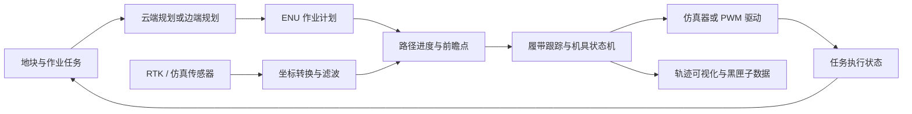

# NodeFlow 项目总结

> 快照日期：2026-07-20  
> 代码基线：`153a9cf`（2026-07-12，`feat: add rotary planning and LAN cloud task orchestration`）  
> 范围：仓库结构、运行时、节点图、仿真、云边任务链路、前端、测试和当前运行状态。

## 1. 项目定位

NodeFlow 是面向农业机器人和低速无人车辆的配置驱动节点编排系统。它以 YAML 描述进程化节点及数据流，覆盖从农田规划、RTK 定位、路径跟踪、机具控制，到仿真复盘、边缘执行和局域网农场任务编排的完整工程链路。

当前系统的目标闭环为：云端或边缘侧准备作业任务，边缘 Runtime 启动节点图，车辆依据 RTK 和 ENU 局部坐标执行路径，期间输出控制、机具和复盘数据，并将任务状态回传至局域网云端。

## 2. 当前代码规模与组成

本次检查基于 661 个 Git 跟踪文件，其中包括 268 个 Python 文件、44 份 YAML 配置、约 125 份文档，以及 99 个测试相关文件。根 `requirements.txt` 的核心依赖为 Python、PyYAML、Pydantic、ZeroMQ、MsgPack、psutil 和 MCP；云端后端使用 FastAPI/SQLAlchemy，两个 Web 前端采用 Vue 3、Vite 和 TypeScript。

| 目录或组件 | 责任 |
| --- | --- |
| `runtime/` | 解析 YAML、校验节点图、构建节点环境、启动/停止/监控子进程，以及接收运行时控制命令。 |
| `sdk/` | 节点 SDK、输入输出端口、共享缓冲区、结构化日志、参数解析和测试工具。 |
| `nodeflow_protocol/` | 云边任务、状态和制品传输使用的共享协议模型。 |
| `node-hub/` | 当前受维护节点库，CLI 扫描到 20 个节点。 |
| `node-back/` | 7 个早期或兼容节点，保留用于历史场景和参考，不是主规划闭环的首选。 |
| `simulator/` | 农田、车辆运动、传感器和 TCP 服务仿真。 |
| `cloud/` | 局域网农场管理服务、任务调度、MQTT/SSE 通信和 Vue 管理前端。 |
| `web-editor/`、`backend/`、`gui/` | 节点图可视化编辑、Runtime API 包装和桌面控制界面。 |
| `tools/cli/` | 面向运维和诊断的命令行控制面。 |
| `examples/`、`tests/` | 运行图样例、单元测试、集成测试和协议测试。 |

## 3. 运行时与通信模型

### 3.1 YAML 节点图

运行图在 `examples/*.yaml` 中声明节点实例、参数和端口边。Runtime 会解析配置、扫描 `node.yaml` 清单、验证图拓扑并按依赖顺序启动节点。节点是独立进程，清单定义其端口类型、输出缓冲区与参数契约。

当前主样例 `examples/planning_simulation.yaml` 使用 10 个节点，静态拓扑分为 8 层：

1. `sim_output`
2. `rtk_filter`
3. `coord_transform`
4. `global_coverage`
5. `path_progress`
6. `waypoint_selector`
7. `track_controller` 与 `tillage_controller`
8. `sim_input` 与 `trajectory_viz`

### 3.2 IPC、数据契约与可观测性

节点输出写入共享缓冲区，并使用 ZeroMQ 进行实时通知。该混合模型保留最新值，使后启动的消费者仍可读取已发布的数据；输出端口可以定义缓冲区大小和 latest-value（`conflate`）语义。Pydantic 模型和端口类型用于约束数据格式，结构化日志写入 `/tmp/nodeflow/logs/`，CLI 可按节点和时间范围检索。

Runtime 同时提供父进程监控、子进程组清理、启动协调和重启策略。常用控制面是 `./nodeflow-cli`：`runtime`、`node`、`buffer`、`health`、`monitor`、`logs`、`simulator` 和 `task` 子命令均支持结构化 JSON 输出。

## 4. 主作业闭环

### 4.1 坐标与定位

外部定位数据以 WGS84 进入，`rtk_filter` 平滑 RTK 数据，`coord_transform` 将位置和航向转换为统一的 ENU 局部米制坐标。所有规划、跟踪和可视化主路径均以 ENU 为坐标基准，并使用数学航向约定（东向为零、逆时针为正）。

云边协同模式下，农场坐标参考系含 ID、版本和参考经纬高；任务与路径制品携带该快照，边端在加载前校验参考系和制品完整性，避免在错误原点下执行路径。

### 4.2 规划、跟踪与执行

`global_coverage` 支持 `parallel` 与 `contour_spiral` 两类规划策略：前者面向往复式作业行，后者面向旋耕等希望减少地头掉头和机具升降的连续轮廓作业。规划结果包含普通 `global_path`，以及含工作区、掉头段、速度上限和机具意图的 `operation_plan`。

`path_progress` 将实时位姿投影到作业计划；`waypoint_selector` 基于路径进度选择目标点；`track_controller` 针对履带底盘输出线速度和角速度，并能在地头段转为按路径航向对齐的控制模式。`tillage_controller` 用 PTO 与三点悬挂状态机处理作业、升降和紧急停止。输出可以接入 `sim_input` 驱动仿真器，也可以经 `pwm_driver` 映射为硬件控制信号。

`trajectory_viz` 汇聚地块、规划路径、实际轨迹、控制命令、路径进度及机具状态，提供实时界面和复盘指标。`logger`、`position_recorder` 与 `trajectory_loader` 支持数据记录、轨迹回放和云端作业计划加载。

### 4.3 节点库

20 个当前节点可按职责分为：

- 定位与输入：`rtk_driver`、`rtk_filter`、`sim_output`、`coord_transform`、`parcel_planner`、`trajectory_loader`。
- 规划与跟踪：`global_coverage`、`path_progress`、`waypoint_selector`、`track_controller`、`arc_tracker`。
- 执行与安全：`sim_input`、`pwm_driver`、`tillage_controller`、`idle_detector`、`shutdown_manager`、`web_teleop`。
- 记录与呈现：`trajectory_viz`、`logger`、`position_recorder`。

真机接入已有 RTK 驱动、PWM 驱动、Web 遥控和对应示例；当前实机运行仍须完成 PWM 映射、RTK 天线偏移、履带打滑参数和机具实际状态的现场校准。

## 5. 云边任务与农场管理

`cloud/server/` 是 FastAPI 服务，提供地块、机器、作业、任务、文件、坐标系设置和 SSE 事件接口。其服务层负责地块分割、云端路径规划、MQTT 下发、心跳监控和任务调度；数据模型覆盖地块、机器、作业、边缘任务、坐标参考系和版本化路径制品。

边端 `runtime/task/` 中的 Agent 接收 MQTT 任务和取消命令，按统一协议下载并校验 MsgPack 路径制品，选择边端规划或云端路径加载图，通过 Runtime control buffer 启停数据流，并回传执行状态。支持的规划模式为：

- `edge`：边端按任务资产本地规划，适合单机作业。
- `cloud`：云端生成路径制品，边端校验后直接执行。
- `cloud_preferred`：优先云端路径，仅在任务明确允许时回退到边端重规划。

云端调度支持有顺序与依赖的 Job 步骤、同机串行下发、QoS 1 重投幂等、确认式取消、心跳失联状态和后续步骤自动推进。配套的 `scripts/install_cloud_lan.sh` 与 `scripts/install_edge_service.sh` 面向农场局域网部署。

## 6. 前端与辅助工具

- `cloud/web/`：农场地图、机器看板、作业创建/详情、坐标参考点与任务状态管理前端。
- `web-editor/`：基于 Vue Flow 的节点图编辑器，读取节点清单、校验类型、生成 YAML，并封装 Runtime API。
- `backend/app.py`：Web 编辑器的 Python API 包装层。
- `gui/`：Runtime 桌面控制与用户指南。
- `mcp_server.py`：为 AI 辅助诊断提供节点查询、配置校验和 Runtime 管理入口。

## 7. 本次检查的运行与质量状态

### 7.1 当前运行状态

2026-07-20 的 CLI 只读检查结果：

- `./nodeflow-cli runtime status --json`：Runtime 未运行。
- `./nodeflow-cli buffer list --json`：缓冲区目录为空。
- `health flow` 与单次 `monitor`：主仿真图的 12 个预期缓冲区均为 `MISSING`，返回原因 `runtime_not_running`。

这表示数据流尚未启动，不表示 YAML 图、端口或规划逻辑损坏。本次检查没有启动 Runtime 或仿真器，因此未留下服务进程或运行产物。

### 7.2 已通过验证

| 验证 | 结果 |
| --- | --- |
| `pytest -q tests/unit cloud/server/tests` | 123 passed |
| 规划/路径进度/跟踪/复盘节点子集 | 32 passed |
| 上述 Python 验证合计 | 155 passed |
| `cloud/web` 的 `npm run build` | 通过 |
| `web-editor` 的 `npm run build` | 通过 |
| CLI 节点扫描 | 20 个 `node-hub` 节点可被识别 |

### 7.3 当前测试基线中的问题

根目录直接执行 `pytest -q` 在收集阶段报告 9 个错误，因此当前不能把它描述为全仓全绿。错误可归为三类：

1. `tests/mcp/test_error_responses.py` 导入 `RuntimeManager` 时，`/tmp/nodeflow/logs` 的父目录不存在。
2. `global_coverage` 与 `rtk_driver` 的节点测试按直接模块名导入，和根目录的 `--import-mode=importlib` 收集方式不兼容。
3. `trajectory_viz` 的部分旧测试导入通用模块名 `web_server`，在全量收集时解析到了 `parcel_planner` 的同名模块。

两个 Web 构建均有单个压缩后大于 500 KiB 的 bundle 警告；这不阻止发布，但后续可通过路由/库拆包降低首次加载体积。Python 包元数据中的 `setup.py` 仍标为 `0.1.0`，应在正式发布前与当前功能版本策略统一。

## 8. 已实现边界与后续重点

项目已具备可运行的仿真和云边任务工程基线，但尚未达到可直接替代田间验收的程度。下一阶段应优先：

1. 在真实地块和低速真机上验证路径曲率约束、掉头控制、履带打滑与 PWM 映射。
2. 用黑匣子数据复盘 RTK 状态、横向误差、控制输出、机具状态与覆盖率，而不是只依赖最终轨迹截图。
3. 完成 Cloud Box、MQTT、Web/API 和至少一台边端设备的局域网端到端联调，再扩展到多机作业步骤。
4. 修复全量 pytest 的测试隔离与初始化前置条件，并建立能覆盖“仿真器 + Runtime + 规划 + 跟踪 + 机具 + 回传”的端到端回归测试。
5. 在功能链路稳定后补齐登录鉴权、MQTT 设备凭据、备份恢复、防火墙和部署安全固化。

## 9. 相关入口

- 主运行图：`examples/planning_simulation.yaml`
- 真实 RTK 规划示例：`examples/planning_with_real_rtk.yaml`
- LAN 私有云设计：[LAN_PRIVATE_CLOUD_DESIGN.md](LAN_PRIVATE_CLOUD_DESIGN.md)
- CLI 使用说明：[`tools/cli/doc/AI_CLI_USAGE_GUIDE.md`](../tools/cli/doc/AI_CLI_USAGE_GUIDE.md)
- 节点开发与 SDK：[`sdk/README.md`](../sdk/README.md)
- 仿真器：[`simulator/README.md`](../simulator/README.md)
- 云端开发：[`cloud/docs/DEVELOPMENT.md`](../cloud/docs/DEVELOPMENT.md)
- 最近一次功能迭代记录：[SESSION_WORK_SUMMARY_20260712.md](SESSION_WORK_SUMMARY_20260712.md)
