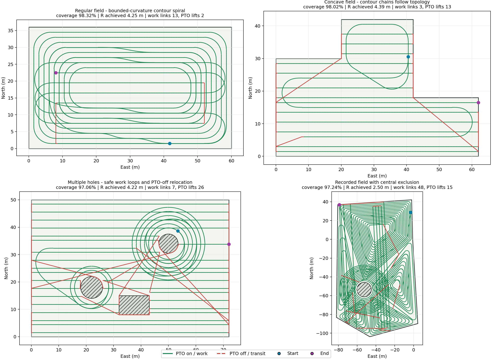
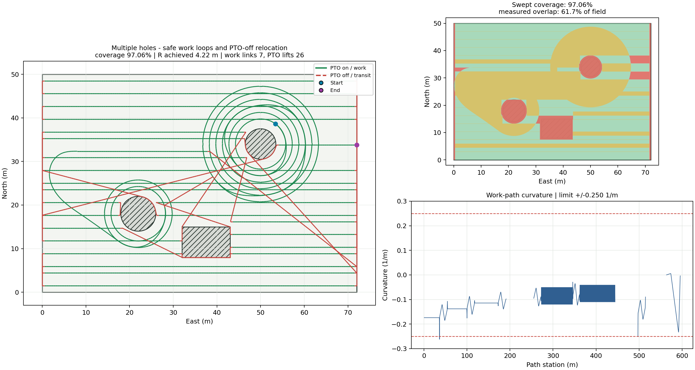

# NodeFlow 会话工作总结

日期：2026-07-12

关联提交：`153a9cf feat: add rotary planning and LAN cloud task orchestration`

## 1. 本轮目标

本轮先从现有路径生成节点只适合开沟、起垄类往复作业的问题出发，补充适合旋耕的连续回环路径；随后检查边侧框架，在确认边侧主链路基本可用后，继续推进农场局域网内的云端任务编排、云端/边端双侧规划和统一坐标参考系。

本轮形成的核心判断是：

- 不按作物类型复制多个路径生成节点，而是在统一的全局覆盖节点内按作业类型和配置选择规划策略。
- 开沟、起垄、播种继续适合平行作业行或往复路径；旋耕优先采用同心轮廓/双螺旋结构，减少地头掉头和机具抬升。
- 最小转弯半径是硬约束，重叠率是可以放宽的软成本。为了保持机具持续入土，可以接受更大半径、更长连接段和更高重叠。
- 云端按农场局域网私有云建设，不假设公网 SaaS；一台设备仍可只使用边侧规划，多机协同时可使用云端规划。
- 云端和边端必须共享同一 ENU 坐标参考系，但参考点不写死。自建网由用户按 RTK 固定站位置配置，单机模式可由首次有效定位建立参考点。

## 2. 旋耕路径规划

### 2.1 规划策略

在 `global_coverage` 中新增 `contour_spiral` 策略，并保留原有规划方式。作业流程通过 `planning_strategy` 等参数选择方法，不需要为了每种作物或农具复制一套节点和数据流。

当前旋耕策略的主要行为：

- 对可作业区域逐层生成内缩轮廓。
- 对多个轮廓方向、入口和连接候选进行选择，形成连续的同心/双螺旋路径。
- 尽量在工作状态下连接相邻轮廓，减少原地掉头和机具升降。
- 输出覆盖率、不安全覆盖面积、重叠面积、实际重叠率等质量指标。
- 输出最大曲率、实际达到的最小转弯半径和连接段最大曲率变化率，便于判断路径是否符合车辆能力。

### 2.2 最小转弯半径

初版可视化暴露出连接路径没有充分体现车辆最小转弯半径的问题，因此后续改为曲率约束连接：

- 使用 `pyclothoids` 构造 G2 连续连接段。
- 用 `min_turn_radius_m` 限制最大曲率。
- 用 `max_curvature_rate_1pm2` 限制曲率变化速度。
- 不可行时优先增加有效重叠、重复部分轮廓或选择更长连接，而不是生成小半径急转路径。
- 若找不到满足约束的工作态连接，则显式报告规划不可行，避免静默输出车辆无法执行的路径。

这符合旋耕作业的效率偏好：重叠带来的少量重复作业通常比频繁抬升机具、停车和重新入土更可接受。

### 2.3 凹地块和孔洞

地块几何继续以“先把带孔或凹多边形处理为可规划的非凹工作区域”为前提。旋耕规划在自由空间内生成轮廓，并把孔洞视为不可穿越障碍：

- 作业带不得覆盖孔洞。
- 相邻轮廓的连接段必须位于安全工作区域内。
- 多孔地块可以形成多条轮廓链，再通过安全连接组织为可执行路径。
- 对孔洞边界和尖角进行膨胀/平滑可行性判断，避免为贴合几何边界而违反最小转弯半径。

已有测试覆盖矩形地块、凹地块、单孔、多孔和较大最小转弯半径场景。

### 2.4 可视化结果

生成了普通轮廓螺旋和曲率约束版本的对比图，覆盖规则地块、凹地块、多孔地块和记录地块。

曲率约束总览：



多孔地块示例：



完整图片位于：

- `docs/images/contour_spiral/`
- `docs/images/contour_spiral_curvature/`

当前判断：这套算法已经可以作为旋耕规划基线，但路径长度、重复作业比例、入口选择、狭窄区域处理和多区域访问顺序仍有明显优化空间，需要结合真实车辆尺寸和地块数据继续迭代。

## 3. 统一坐标参考系

新增农场坐标参考系模型和设置接口，解决云端规划、边端规划结果无法稳定对齐的问题。

- 坐标系类型为 ENU，保存 `frame_id`、版本、参考经纬高和来源。
- 系统没有硬编码默认参考点；未配置参考系时，云端不会贸然下发依赖该坐标系的任务。
- 农场自建网可在设置页手工录入 RTK 固定站位置。
- 每个任务和云端路径制品都携带坐标系快照与版本。
- 边端加载路径时校验任务与制品的坐标系是否一致，防止路径在错误原点下执行。
- WGS84 地块先投影到局部坐标系后再计算面积、分割和规划，避免直接在经纬度平面上做米制几何运算。

## 4. 云端/边端双侧规划

新增统一任务协议，支持三种规划模式：

- `edge`：边端收到地块和作业配置后本地生成路径，适合单机独立工作。
- `cloud`：云端生成版本化路径制品，边端下载并直接执行。
- `cloud_preferred`：优先使用云端路径；只有显式允许边端重规划时才可回退。

云端路径制品采用 MsgPack 封装，包含：

- 路径和作业段信息。
- 制品版本与修订号。
- 地块校验信息。
- 坐标参考系快照。
- SHA-256 完整性校验值。

边端下载后会检查任务 ID、修订号、地块校验值、坐标系版本和制品摘要。校验通过后由 `trajectory_loader` 注入运行图；边端规划模式则由任务资产层生成地块启动参数并切换到本地规划图。

## 5. 局域网云端任务编排

云端从原先未完成的接口骨架推进到可验证的局域网任务闭环：

- Job 支持多个有顺序和依赖关系的 JobStep。
- 每个步骤可以独立指定作业类型、规划模式、作业参数和机器分配。
- 同一台机器的任务串行下发，避免一台车同时接收多个可执行任务。
- 前序步骤完成后自动推进后续步骤。
- MQTT 下发和状态消息使用 QoS 1，重复投递按任务 ID 幂等处理。
- 状态机只允许单调推进，避免迟到消息把已完成任务回滚到运行中。
- 增加 ACK 超时重发、取消超时重发和后台调度协调器。
- 机器心跳超时后，运行中任务进入 `communication_lost`，保留恢复和人工处置空间。
- 取消改为确认式流程：云端先进入 `cancel_requested`，边端停止运行图并回报后才进入最终状态。
- Job 的完成以所有必要步骤和边端任务安全完成为依据，不再只看一次消息上报。

前端同步补充了作业步骤、规划模式、回退策略、机器分配和坐标参考点配置入口。

## 6. 边侧运行时补齐

边侧框架本轮补充了云端任务真正落地所需的能力：

- TaskAgent 接收统一任务协议、任务取消和 QoS 1 重投。
- 下载并校验云端路径制品。
- 按任务选择本地规划图或云端轨迹加载图。
- 通过 runtime control buffer 启停数据流并注入节点参数。
- 任务执行完成、失败或取消后回传状态。
- 真机 RTK 旋耕示例补齐 `path_progress`、`track_controller` 和相关端口连接。
- 修复共享缓冲区、端口读取和启动协调中的边界问题，并增加对应单元测试。

同时新增局域网部署脚本：

- `scripts/install_cloud_lan.sh`
- `scripts/install_edge_service.sh`

详细部署和职责边界见 `docs/LAN_PRIVATE_CLOUD_DESIGN.md`。

## 7. 验证结果

本轮累计完成以下验证：

- 云端规划、坐标系、调度推进和资源链路测试：15 项通过。
- 全局覆盖及旋耕规划测试：52 项通过。
- waypoint 和 path progress 测试：17 项通过。
- trajectory loader 测试：6 项通过。
- parcel planner 测试：52 项通过。
- 相关自动化测试合计：142 项通过。
- 云端前端 `npm run build` 通过。
- 真机 RTK 旋耕图可以由 daemon 完成初始化，验证后已停止。
- SQLite `integrity_check` 返回 `ok`，原有 1 个地块和 1 个 Job 数据保留。
- 提交前 `git diff --check` 通过。

## 8. 当前边界与后续建议

今天完成的是可继续集成和试验的工程基线，尚不能替代田间验收。后续建议按以下顺序推进：

1. 使用真实地块、机具宽度、车辆轴距和允许转弯半径评估旋耕路径，重点统计总路径长度、非作业距离、重复覆盖率和机具升降次数。
2. 优化轮廓入口、层间连接和多分区访问顺序，避免为了满足曲率约束产生过长重复路径。
3. 在真机低速条件下验证 G2 连接段与履带车辆实际控制响应是否匹配，必要时把车辆运动学和控制器跟踪误差纳入规划代价。
4. 完成 Cloud Box、MQTT、Web/API 和一台边端设备的局域网端到端联调，再扩展到多机步骤编排。
5. 功能闭环稳定后补充登录鉴权、MQTT 设备凭据、备份恢复和防火墙固化；这些安全项当前仍明确后置。

## 9. 提交情况

本轮实现已提交并推送至 `origin/master`：

```text
153a9cf58c3196e3718ba5181637973e892db30f
feat: add rotary planning and LAN cloud task orchestration
```

该提交共涉及 100 个文件，新增 6701 行，删除 534 行。
