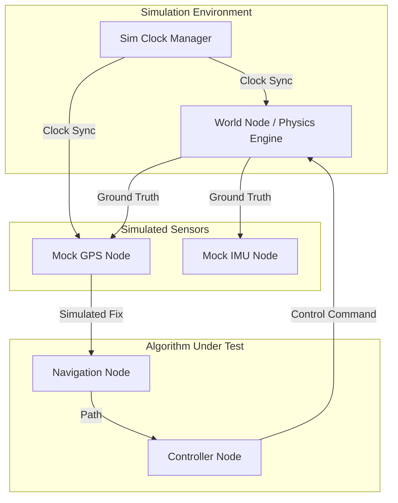

# NodeFlow 仿真工具设计文档

**状态**: 草案 (Draft)
**版本**: 1.0
**日期**: 2025-12-20

---

## 1. 概述

NodeFlow 仿真工具旨在为低速无人车算法开发提供一个高保真、可交互、可重现的测试环境。基于现有的 NodeFlow 节点化架构，仿真工具将作为一个特殊的“环境包围圈”，通过模拟传感器输入和执行器反馈，实现算法的闭环测试。

### 核心目标
- **硬件解耦**：在无需真实车辆的情况下验证导航、控制和避障算法。
- **边界测试**：模拟极端情况（如传感器失效、网络延迟、恶劣天气）。
- **效率提升**：支持加速仿真和自动化场景回归测试。
- **可视化**：直观展示车辆状态、路径规划结果和环境信息。

---

## 2. 核心特性

### 2.1 虚拟世界管理器 (World Node)
作为仿真的“上帝节点”，负责维护唯一的真值 (Ground Truth)：
- **运动学模型**：模拟车辆的物理特性（单轨模型、差速模型等）。
- **环境地图**：加载地块 (Parcel)、障碍物和禁行区。
- **多车支持**：支持多个智能体在同一场景中交互。

### 2.2 仿真时钟管理 (Sim Clock)
解决分布式节点间的时间同步问题：
- **逻辑时钟**：支持暂停、单步执行和倍速仿真（如 2x, 5x）。
- **时间同步机制**：通过统一的时钟总线广播仿真时间戳，确保所有节点步调一致。

### 2.3 高保真传感器模拟
不再是简单的随机噪声，而是基于物理规律的模拟：
- **GPS/RTK**：模拟星历遮挡、多路径效应和 RTK 基站掉线。
- **IMU**：模拟零偏不稳定性 (Bias Instability) 和随机游走噪声。
- **感知模拟**：模拟激光雷达或摄像头对虚拟障碍物的检测。

### 2.4 交互式可视化看板 (Web Dashboard)
- **2D/3D 地图**：基于 Leaflet 或 Three.js 展示车辆轨迹和地块边界。
- **实时图表**：监控速度、转向角、偏差 (Crosstrack Error) 等关键指标。
- **交互控制**：支持手动下发任务、放置障碍物或触发故障注入。

### 2.5 场景引擎 (Scenario Engine)
- **脚本化定义**：使用 YAML 定义仿真场景（起点、终点、动态障碍物路径）。
- **故障注入**：在特定时间点模拟电机过热、传感器漂移等异常。

---

## 3. 技术架构

仿真工具将深度集成到现有的 NodeFlow 架构中：

---

## 4. 实施路线图

### 第一阶段：闭环基础 (Phase 1)
- 实现 **World Node**，集成基本的车辆单轨运动学模型。
- 建立闭环：Controller 输出指令 -> World Node 更新位姿 -> Mock GPS 输出位姿。

### 第二阶段：时钟同步 (Phase 2)
- 引入 **Sim Clock**，支持非实时仿真。
- 优化 SDK，使其能够感知并使用仿真时间戳而非系统时间。

### 第三阶段：环境与交互 (Phase 3)
- 实现 Web 可视化工具，支持地块加载。
- 增加动态障碍物模拟。

### 第四阶段：自动化与场景 (Phase 4)
- 场景定义规范化。
- 支持回归测试，自动生成测试报告。
